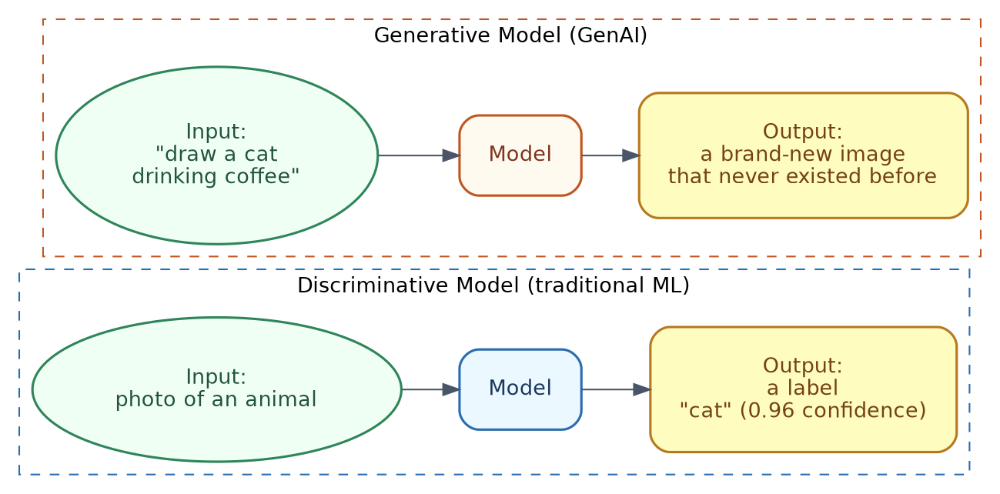
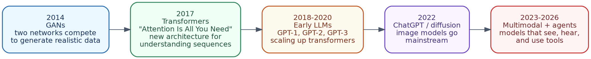
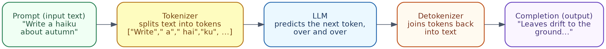
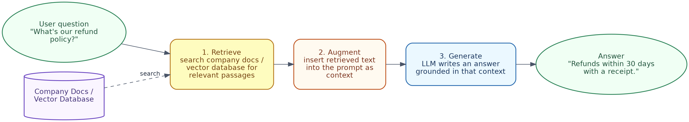

# Generative AI Fundamentals Handbook
### A Detailed Guide, in Simple Indian English, with Examples and a Hands-On Lab

---

## Table of Contents

1. Welcome / Introduction
2. What is Generative AI? (Simple Analogy)
3. Why Generative AI Was a Breakthrough
4. Core Concepts
5. Large Language Models (LLMs)
6. Prompt Engineering
7. Other Generative Modalities
8. Retrieval-Augmented Generation (RAG)
9. AI Agents
10. Azure OpenAI / Copilot Ecosystem
11. Responsible Generative AI
12. Limitations of Generative AI
13. Hands-On Lab: Generate Employee Content from Real Data
14. Where to Go Next

---

## 1. Welcome / Introduction

Welcome to the Generative AI Fundamentals Handbook. This builds directly on top of the AI Fundamentals Handbook — if you are comfortable with terms like "model," "training data," and "supervised learning," you are ready for this one.

**What is different about Generative AI:** the earlier handbook was mostly about models that *predict* something about existing data (a label, a category, a number). Generative AI is about models that *create* new content — text, images, audio, code — that did not exist before.

**Prerequisites:**
- Comfortable with the core ML vocabulary from the AI Fundamentals Handbook (model, training data, features)
- No coding needed for most sections; Section 13 (Hands-On Lab) has Python code you can copy and run

**How this handbook is organised:**
- Sections 2-4 build up the basic concepts
- Sections 5-9 cover the main technology families (LLMs, prompting, other modalities, RAG, agents)
- Section 10 connects this to the Azure/Microsoft ecosystem, continuing from the earlier handbook
- Sections 11-12 cover responsibility and limitations — please read these too, even if you want to jump ahead to the fun parts
- Section 13 is a hands-on coding lab, using a completely free, local model
- Section 14 points you towards next steps

Since you already use tools like **ChatGPT**, **Claude**, and **Cursor**, this handbook will keep connecting each concept back to something you have probably already noticed while using them.

---

## 2. What is Generative AI? (Simple Analogy)

**Simple analogy:** Imagine two art students.

- Student A is shown thousands of paintings, and learns to say, *"this one is a landscape," "this one is a portrait."* That is a **discriminative** model — it classifies or predicts, based on existing input.
- Student B is shown thousands of paintings, and is then asked to *paint a brand-new landscape, in the style of Monet.* That is a **generative** model — it creates new content that did not exist before, based on the patterns it learned.

**One-line definition:**
> Generative AI means models that produce new content — text, images, audio, video, or code — instead of simply classifying or predicting a value from existing data.

### Discriminative vs. Generative Models



| | Discriminative Model | Generative Model |
|---|---|---|
| **Goal** | Predict a label or value | Create new content |
| **Example input** | A photo | A text description |
| **Example output** | "cat" (a label) | A brand-new image of a cat |
| **Typical use** | Spam detection, price prediction | Writing text, generating images, writing code |

**Everyday example:** Autocomplete on your phone, finishing your sentence for you, is a small example of generative behaviour — it is producing new text, word by word, based on patterns it has learned, rather than just classifying your message into a category.

### In terms of tools you already know

**ChatGPT** and **Claude** are both generative models — every single reply they give you is newly created text, not something copied from a lookup table. **Cursor** is also generative, just applied to code — when it writes a new function for you, it is generating that code fresh, based on patterns learned from huge amounts of programming code during training.

---

## 3. Why Generative AI Was a Breakthrough

### From narrow AI to general-purpose content creation

Older AI/ML systems were usually **narrow** — a model trained to detect spam could not also write an essay, or generate an image. Each task needed its own separate model, trained from scratch on task-specific data.

Generative AI, especially **Large Language Models (LLMs)**, brought in something quite different — a *single* model that can write essays, answer questions, summarise documents, write code, and hold conversations, all without needing to be retrained for each different task.

### A brief history



- **2014 — Generative Adversarial Networks (GANs):** two neural networks compete — one generates fake images, the other tries to catch the fakes. Over time, the generator becomes extremely good at producing realistic images.
- **2017 — Transformers:** a research paper called *"Attention Is All You Need"* introduced a new architecture, which could process a whole sequence of text at once, paying "attention" to the most relevant words, regardless of their position. This became the foundation for almost all modern LLMs.
- **2018-2020 — Early LLMs:** models like GPT-1, GPT-2, and GPT-3 showed that simply scaling up transformer models (more data, more parameters) gave dramatically better, more general-purpose text generation.
- **2022 — Mainstream breakthrough:** ChatGPT brought conversational LLMs to a mass audience; diffusion-based image generators (like DALL-E 2 and Stable Diffusion) made text-to-image generation widely accessible.
- **2023-2026 — Multimodal models and agents:** models that can process text, images, and audio together, and increasingly, models that can use external tools to actually take actions, instead of just generating text.

**Why this mattered practically:** a business that once needed separate models for sentiment analysis, translation, summarisation, and chatbots, could now often just use *one* well-prompted LLM, for all four tasks.

### In terms of tools you already know

**Claude** and **ChatGPT** sit right at the end of this timeline — both are general-purpose models that can write, summarise, translate, and code, all using the same underlying model, without needing separate models for each task. **Cursor** is a great example of this generality being put to specific use — the same kind of general LLM technology, focused specifically on reading and writing code inside an editor.

---

## 4. Core Concepts

Before going further, here are the vocabulary terms that keep coming up in any Generative AI discussion.

| Term | Simple meaning | Example |
|---|---|---|
| **Token** | A chunk of text the model processes — roughly a word, or part of a word | "unbelievable" might get split into `un`, `believ`, `able` |
| **Embedding** | A numeric representation of text (or images), that captures meaning, so a computer can compare "similarity" | "king" and "queen" have embeddings that sit mathematically close together |
| **Context window** | The maximum amount of text (measured in tokens) a model can "see" at once, including both prompt and response | A model with a 128,000-token context window can handle roughly 300 pages of text at once |
| **Prompt** | The input text you give the model | "Write a short poem about the ocean" |
| **Completion** | The text the model generates, in response | The poem itself |
| **Parameters** | The internal numeric values a model learns during training — loosely, the "size" of the model's knowledge capacity | A model might have anywhere from millions to hundreds of billions of parameters |
| **Training** | The (very expensive, one-time) process of teaching a model, by having it predict text across huge datasets | Takes weeks, and significant computing power, for large models |
| **Inference** | The (comparatively cheap, repeatable) process of actually using a trained model, to generate a response | What happens every single time you send a prompt |
| **Fine-tuning** | Further training an already-trained model on a smaller, specific dataset, to specialise it | Fine-tuning a general LLM on a company's support tickets, so it writes better support replies |

### How tokens and generation actually work (simplified)

An LLM does not generate a whole sentence in one go. It predicts **one token at a time**, each time looking at everything generated so far.

**Simple example:**
```
Prompt: "The capital of France is"
Step 1: model predicts next token → " Paris"
Step 2: model predicts next token → "."
Result: "The capital of France is Paris."
```

This "predict the next token, over and over" process is basically the core mechanism behind almost all modern text generation, even though the results can feel much more clever than simple autocomplete.

### Training vs. fine-tuning vs. prompting (three ways to shape behaviour)

| Approach | What happens | Cost/effort | Example |
|---|---|---|---|
| **Pretraining** | Model learns general language patterns, from massive, broad datasets | Extremely high (done once, by a small number of organisations) | Training an LLM on a large chunk of the public internet |
| **Fine-tuning** | An existing pretrained model gets further trained, on a smaller, specific dataset | Moderate | Fine-tuning a model to write in a company's specific tone and terminology |
| **Prompting** | No retraining at all — you just phrase your input carefully, to get the output you want | Low (instant, no special access needed) | Adding "Answer in bullet points" to your question |

Most people using Generative AI, in everyday life, only ever do the third one — prompting — which is why the Prompt Engineering Handbook covers it in more detail.

### In terms of tools you already know

Every time you type into **ChatGPT** or **Claude**, you are doing "inference" (using an already-trained model), not "training." When Anthropic or OpenAI release a new model version, that is the result of pretraining and fine-tuning happening behind the scenes, over weeks or months, before it ever reaches you. **Cursor's** underlying model has also gone through this same pipeline, with extra fine-tuning specifically on code, so it performs better on programming tasks than a purely general-purpose model might.

---

## 5. Large Language Models (LLMs)

### How LLMs generate text



**Step-by-step, in plain terms:**
1. Your prompt text gets broken into **tokens**.
2. The model processes those tokens, and calculates a probability for every possible "next token" in its vocabulary.
3. It picks one (usually the most likely one, though some randomness/"creativity" can be added).
4. It repeats this, adding one token at a time, until it decides the response is complete, or hits a length limit.
5. The tokens get joined back into readable text.

**Simple example:**
Prompt: *"Write a haiku about autumn"*
The model does not "know" haikus are 5-7-5 syllables, in some deep symbolic sense — it has simply seen enough haiku examples during training, that it has learned to produce text following that pattern, when asked.

### Pretraining, fine-tuning, and prompting for LLMs specifically

- **Pretraining:** an LLM gets exposed to enormous amounts of text (books, websites, code, and so on), and learns to predict the next token extremely well, across a huge variety of contexts.
- **Fine-tuning / alignment:** after pretraining, models usually go through additional steps (like reinforcement learning from human feedback), to make them more helpful, better at following instructions, and less likely to produce harmful output.
- **Prompting:** the way you phrase your request at the actual moment of use, without changing the model itself.

### Well-known LLM families (brief, factual overview)

| Family | Maker | Notable for |
|---|---|---|
| **GPT series** | OpenAI | Popularised conversational LLMs, through ChatGPT |
| **Claude** | Anthropic | Strong emphasis on safety research, and handling long context well |
| **Llama** | Meta | Openly available model weights, widely used for local/self-hosted setups |
| **Gemini** | Google DeepMind | Multimodal (text, image, audio) capability, built in from the start |

*Note: this space moves fast — treat this table as a snapshot of the major families, rather than a current leaderboard.*

### Simple example: same prompt, different outcome, based on model settings

| Setting | Effect | Example |
|---|---|---|
| **Temperature (low, e.g. 0.1)** | More predictable, focused output | Good for factual Q&A |
| **Temperature (high, e.g. 0.9)** | More varied, creative output | Good for brainstorming, creative writing |
| **Max tokens** | Limits how long the response can be | Setting a low limit forces a short answer |

### In terms of tools you already know

**ChatGPT** is built on OpenAI's GPT family, and **Claude** is Anthropic's own LLM family — the very tools you already use daily are direct, real-world examples of this whole section, not just theory. **Cursor** actually lets you pick between different underlying models (including GPT and Claude models) for its chat and agent features, so you can literally see this "well-known LLM families" table, sitting right there in Cursor's own model-picker dropdown.

---

## 6. Prompt Engineering

Prompt engineering is the practice of crafting your input, to get better, more reliable output from a generative model — without changing the model itself. (This handbook gives the short version — the full Prompt Engineering Handbook covers this in much more depth.)

### Zero-shot vs. few-shot prompting

**Zero-shot** — you ask directly, with no examples:
```
Prompt: "Classify the sentiment of this review: 'The food was cold and the service was slow.'"
```

**Few-shot** — you give a few examples first, to show the pattern you want:
```
Prompt:
Review: "Amazing food, great service!" → Sentiment: Positive
Review: "Terrible experience, never going back." → Sentiment: Negative
Review: "The food was cold and the service was slow." → Sentiment:
```
Few-shot prompting usually gives more consistent formatting and accuracy, especially for tasks with a specific expected output style.

### System prompts vs. user prompts

| Type | Purpose | Example |
|---|---|---|
| **System prompt** | Sets the overall behaviour/role for the whole conversation, usually set by the developer, not the end user | "You are a helpful customer support agent for an airline. Always be polite and concise." |
| **User prompt** | The actual question or request, from the person using the app | "My flight got cancelled, what are my options?" |

**Why this separation matters:** the system prompt lets a business consistently shape how the model behaves across every conversation, without needing every user to repeat the same instructions.

### Common prompting techniques

**1. Be specific about format:**
```
Weak:  "Tell me about electric cars."
Better: "List 3 pros and 3 cons of electric cars, in bullet points, under 100 words."
```

**2. Chain-of-thought prompting** — asking the model to reason step-by-step before answering, which often improves accuracy on multi-step problems:
```
Prompt: "A store had 120 apples. They sold 45 in the morning and 30 in the
afternoon. How many are left? Think step by step before giving the final answer."
```

**3. Role-based prompting:**
```
Prompt: "You are an experienced financial advisor. Explain compound interest
to a 16-year-old in simple terms."
```

**4. Providing constraints:**
```
Prompt: "Summarize this article in exactly 3 sentences, avoiding jargon."
```

### In terms of tools you already know

**ChatGPT's "Custom Instructions"** and **Claude's Project instructions** are basically a permanent system prompt, applied to every conversation after that. If you have used **Cursor**'s "rules" file to always ask it to write TypeScript in a certain style, that is a system prompt too, just applied to a coding tool instead of a chat tool.

---

## 7. Other Generative Modalities

Generative AI is not limited to text. Here are the other major categories.

### Text-to-Image

Most modern image generators use **diffusion models** — models trained to start from random noise, and gradually "denoise" it into a coherent image, matching a text description.

**Simple example:**
```
Prompt: "A watercolor painting of a lighthouse at sunset, in the style of impressionism"
Output: a newly generated image matching that description — not a search result,
        a brand-new image.
```

Well-known text-to-image tools include DALL-E, Stable Diffusion, and Midjourney.

### Text-to-Speech and Voice Generation

Converts written text into natural-sounding spoken audio, often with configurable tone, speed, and even specific voice styles.

**Simple example:** A screen-reader app converts an article into audio, so someone can listen while commuting, using a voice that sounds natural, rather than robotic.

### Code Generation

LLMs trained heavily on programming code (in addition to natural language) can generate, explain, and debug code.

**Simple example:**
```
Prompt: "Write a Python function that checks if a number is prime"

Output:
def is_prime(n):
    if n < 2:
        return False
    for i in range(2, int(n ** 0.5) + 1):
        if n % i == 0:
            return False
    return True
```

### Text-to-Video (brief mention)

An emerging, fast-developing area — generating short video clips from text descriptions, combining techniques from image diffusion models, with methods for keeping things consistent across frames, over time. This area is less mature than text or image generation, and usually needs significant computing resources.

### In terms of tools you already know

The "Code Generation" example above is exactly what **Cursor** does, all day, every day — and what **ChatGPT** and **Claude** also do, whenever you ask them for code. If you have used **ChatGPT's** image generation feature, or asked **Claude** to help you write a prompt for an image tool like Midjourney, you have already used Text-to-Image generation directly.

---

## 8. Retrieval-Augmented Generation (RAG)

### Why LLMs need external knowledge

LLMs only "know" what was in their training data, up to a certain cutoff date, and have no built-in awareness of your private data (like your company's internal documents). RAG solves this, by giving the model relevant information *at the moment of the question*, instead of trying to retrain it every time something changes.

### The RAG pipeline



**Step-by-step:**
1. **Retrieve:** the user's question is used to search a knowledge source (company documents, a database, a vector database of embeddings) for relevant passages.
2. **Augment:** those retrieved passages get inserted into the prompt as extra context, alongside the original question.
3. **Generate:** the LLM writes an answer, grounded in the retrieved context — rather than relying purely on what it memorised during training.

### Simple example

**Without RAG:**
```
User: "What's our company's refund policy?"
LLM:  (has no idea — this is private company information it was never trained on,
       so it may guess, or say it doesn't know)
```

**With RAG:**
```
Step 1 (retrieve): search finds the company's refund policy document
Step 2 (augment): prompt becomes: "Using this policy: 'Refunds are accepted
        within 30 days with a receipt.' Answer the question: What's our
        company's refund policy?"
Step 3 (generate): LLM: "Refunds are accepted within 30 days of purchase,
        as long as you have a receipt."
```

### Why RAG matters

- Keeps answers grounded in accurate, current, and private information
- Avoids the cost of fine-tuning a model, every single time company documents change
- Reduces (though does not fully remove) hallucination, since the model now has real reference text to draw from

### In terms of tools you already know

When you upload a PDF to **ChatGPT** or **Claude**, and ask questions about it, that is RAG happening right in front of you — the model is reading your specific document, and grounding its answer in it, instead of guessing from general training data. **Claude Projects**, where you attach documents once and ask many questions later, is basically a small, personal RAG system, built right into the product. This same idea gets its own full handbook — the RAG & Vector Databases Handbook — if you want to go deeper.

---

## 9. AI Agents

### Chatbot vs. agent

A basic chatbot answers questions, using only its own generated text. An **agent** goes further — it can decide to take **actions** (like searching the web, calling an API, or running code), as part of producing its final answer.

| | Chatbot | Agent |
|---|---|---|
| **Can it look things up?** | No, only uses what it was trained on | Yes, can call external tools |
| **Can it take actions?** | No | Yes (e.g., send an email, book a flight, query a database) |
| **Example** | "The capital of France is Paris" (from memory) | "Let me check current flight prices" (calls a real flight search tool) |

### Tool use / function calling

Modern LLMs can be given a list of available "tools" (functions), with descriptions of what each one does, and what inputs it needs. The model decides *when* to call a tool, and *with what arguments*, based on the user's request.

**This connects directly to MCP (Model Context Protocol):** if you have read the MCP Handbook, this is exactly the same idea — an LLM deciding to call a tool, getting back a structured result, and using it to form a final answer. MCP simply standardises *how* those tools get exposed to the model; agents are the pattern of *the model actively deciding to use them*.

### The agent loop

**Simple example — a travel booking agent:**
```
User: "Book me the cheapest flight to Paris next Friday."

Step 1 (think): the model reasons it needs current flight data, which it
                doesn't have memorized.
Step 2 (call tool): search_flights(destination="Paris", date="next Friday")
Step 3 (tool result): returns a list of flights with prices.
Step 4 (think again): cheapest option is Air France flight AF123 at $412.
Step 5 (call tool): book_flight(flight_id="AF123")
Step 6 (final answer): "Booked! Flight AF123, $412, departs 9am Friday."
```

This loop — think, act, observe, repeat — is basically the essence of most agent designs, whether simple or highly complex. (The Agentic AI Handbook covers this in a lot more detail, with its own hands-on lab.)

### A note on risk

Because agents can take real actions (not just generate text), they carry more risk than plain chatbots — a wrong tool call could send an incorrect email, or make an unwanted purchase. This is why agent systems usually include human-approval steps for anything consequential.

### In terms of tools you already know

**Cursor** is a real, everyday agent — when you ask it to "fix this bug," it does not just describe the fix, it actually reads the file, edits it, and can even run your tests, all on its own, in a proper think-act-observe loop. **ChatGPT** with browsing turned on, or **Claude** using a connected tool, are both stepping from "chatbot" into "agent" mode, the exact moment they decide to search or call something, instead of just answering from memory.

---

## 10. Azure OpenAI / Copilot Ecosystem

### Azure OpenAI Service (basics)

Azure OpenAI Service gives businesses access to OpenAI's models (like the GPT family), through Microsoft's Azure cloud platform, adding enterprise features such as private networking, regional data residency, and integration with other Azure services.

**Why a business might pick this, over calling OpenAI directly:**
- Data handling agreements that fit enterprise compliance needs
- Integration with existing Azure infrastructure (identity, monitoring, storage)
- Consistent billing, alongside other Azure services

### Microsoft Copilot examples

"Copilot" is Microsoft's branding for AI assistants built directly into everyday tools, instead of being a separate chat window.

| Product | What it does |
|---|---|
| **Copilot in Word** | Drafts documents, rewrites paragraphs, summarises long documents |
| **Copilot in Excel** | Explains formulas, generates formulas from plain-language descriptions, highlights data trends |
| **Copilot in PowerPoint** | Generates a first-draft slide deck, from a prompt or a document |
| **GitHub Copilot** | Suggests code completions and entire functions, directly inside a code editor, based on context |

**Simple example:** A developer writes a comment `# function to reverse a string`, inside their code editor, and GitHub Copilot suggests the completed function automatically, based on the pattern of the comment and surrounding code.

### In terms of tools you already know

**GitHub Copilot** and **Cursor** solve the exact same problem — AI-assisted coding — just built by different companies, with slightly different approaches. If you have used both, you already understand the "Copilot ecosystem" idea quite well, since Cursor itself is directly inspired by, and competing with, this same category of tool.

---

## 11. Responsible Generative AI

This builds on the Responsible AI principles from the AI Fundamentals Handbook, with a few issues specific to generative models.

### Hallucinations

A hallucination is when a model generates confident-sounding, plausible text, that is actually false or made up.

**Simple example:**
```
Prompt: "Who won the Nobel Prize in Physics in a fictional year like 2150?"
Risk: the model might confidently invent a name and details, rather than
      recognizing it cannot know a future event.
```
**Mitigation:** grounding answers with RAG (Section 8), asking the model to cite sources, and treating factual claims from any generative model as needing verification, for anything important.

### Bias in generated content

Because generative models learn patterns from large training datasets (which often reflect biases present in real-world text or images), they can reproduce or amplify those same biases.

**Simple example:** An image generator asked for "a picture of a doctor," without further detail, might disproportionately generate images matching one gender or ethnicity, reflecting imbalances in its training data, rather than reality.

### Copyright and IP considerations

Generative models are trained on large datasets that may include copyrighted material, which raises open legal and ethical questions about:
- Whether generated output can infringe on existing copyrighted work
- Who actually owns AI-generated content
- Whether using copyrighted material for training itself needs permission

This is an actively evolving legal area — treat any generated content meant for commercial or public use, with a check against your organisation's IP policies.

### Content filtering / moderation

Most production-grade generative AI services include automated content filters, to catch and block harmful outputs — like violent content, hate speech, or unsafe instructions — before they reach the user.

**Simple example:** A content filter might block a request to generate instructions for something dangerous, even if the request is phrased as a "hypothetical," or "for a story."

### In terms of tools you already know

If you have ever seen **Claude** or **ChatGPT** decline to answer something, or add a safety note to a sensitive response, that is content filtering in action. If either has ever confidently given you a fact that turned out to be wrong, that was a hallucination — a good habit is to double-check anything factually important that **ChatGPT**, **Claude**, or even **Cursor**'s suggested code, gives you, rather than trusting it completely on the first try.

---

## 12. Limitations of Generative AI

### Knowledge cutoffs

Most LLMs are trained on data up to a certain date, and do not automatically know about events after that, unless connected to a live tool (like search), or a RAG pipeline.

**Simple example:** A model trained through early 2026 will not know about a product launched in mid-2026, unless it can search the web, or is given that information directly in the prompt.

### Confident fabrication

As covered in Section 11, models can state incorrect information with the exact same confident tone as correct information — there is no built-in signal telling you "I'm sure" apart from "I'm guessing."

### Pattern completion, not true understanding

LLMs generate text by predicting statistically likely continuations, based on patterns learned during training — they do not "understand" content the way a human does, even when the output reads as though they do. This matters in practice: a model can produce fluent, convincing text on a topic, while still getting core facts or logic wrong.

### Other practical limitations

| Limitation | What it means in practice |
|---|---|
| **Context window limits** | Very long documents may need to be split into chunks, since the model cannot "see" unlimited text at once |
| **Consistency** | The same prompt may produce slightly different answers on different runs (especially at higher "temperature" settings) |
| **Math and precise logic** | LLMs can make arithmetic or logical mistakes, especially with multi-step calculations, unless paired with a tool (like a calculator, or code execution) |
| **Cost and latency** | Larger, more capable models are usually slower and more expensive to run, than smaller, specialised ones |

### In terms of tools you already know

**ChatGPT** and **Claude** both mention their knowledge cutoff date, exactly because of this limitation — and both will usually search the web, when available, to work around it. When **Cursor** occasionally suggests a library function that does not actually exist, that is the "pattern completion, not true understanding" limitation showing up directly — it produced code that *looks* correct, based on patterns, without truly "knowing" whether that function is real.

---

## 13. Hands-On Lab: Generate Employee Content from Real Data

This is a complete, working example — a Python script that reads a small set of **fictional employee records**, and uses a **free, local LLM** (via Ollama — the same free tool used in the MCP Handbook's lab), to generate personalised text for each one, like an internal newsletter "employee spotlight," or a welcome message. No API keys, no cost, no real personal data involved.

### What you will build

- `employees.json` — a small file of fictional employee records (name, role, department, tenure, achievement)
- `generate_employee_content.py` — a script that reads each record, builds a grounded prompt from it, and generates text
- **Ollama**, running a free open-source model (e.g., `llama3.1`) entirely on your own machine

**Why this is a good exercise:** it is a small, realistic taste of the same pattern real companies use — grounding generated text in actual structured data, instead of letting the model guess, which directly reinforces the RAG idea from Section 8.

### Step 1 — Install prerequisites

```bash
# Ollama (free, local LLM runner)
brew install ollama
ollama pull llama3.1        # or any other available model

# Python HTTP library
pip install requests
```

Ollama runs a local server at `http://localhost:11434`, once installed — this is the "free LLM" this lab calls, entirely on your own machine, with no internet request, and no API key.

### Step 2 — Create the employee data (`employees.json`)

```json
[
  {
    "name": "Priya Nair",
    "role": "Senior Backend Engineer",
    "department": "Engineering",
    "tenure_years": 4,
    "achievement": "led the migration to a new payments system with zero downtime"
  },
  {
    "name": "Marcus Webb",
    "role": "Sales Manager",
    "department": "Sales",
    "tenure_years": 2,
    "achievement": "grew the regional accounts team's revenue by 30% this year"
  },
  {
    "name": "Aiko Tanaka",
    "role": "UX Designer",
    "department": "Product",
    "tenure_years": 1,
    "achievement": "redesigned the onboarding flow, cutting signup drop-off in half"
  }
]
```

Save this as `employees.json`, in the same folder as the script below. (These are fictional names and details for practice — swap in real data only with proper care and consent, in an actual workplace.)

### Step 3 — The generation script (`generate_employee_content.py`)

```python
"""
generate_employee_content.py — reads employee records from a JSON file
and uses a free, local LLM (via Ollama) to generate a short newsletter
"spotlight" blurb for each employee, grounded in their real data.
"""

import json
import requests

OLLAMA_URL = "http://localhost:11434/api/generate"
MODEL = "llama3.1"


def generate(prompt: str, temperature: float = 0.7) -> str:
    """Send a prompt to the local LLM and return the generated text."""
    response = requests.post(
        OLLAMA_URL,
        json={
            "model": MODEL,
            "prompt": prompt,
            "options": {"temperature": temperature},
            "stream": False,
        },
        timeout=120,
    )
    response.raise_for_status()
    return response.json()["response"]


def load_employees(path: str = "employees.json") -> list[dict]:
    with open(path, "r", encoding="utf-8") as f:
        return json.load(f)


def build_spotlight_prompt(employee: dict) -> str:
    """Ground the prompt in the employee's real data, so the model
    describes this specific person instead of inventing details."""
    return (
        "Write a warm, 3-sentence 'Employee Spotlight' blurb for a company "
        "newsletter, using only the facts below. Do not invent any details "
        "that aren't provided.\n\n"
        f"Name: {employee['name']}\n"
        f"Role: {employee['role']}\n"
        f"Department: {employee['department']}\n"
        f"Tenure: {employee['tenure_years']} years\n"
        f"Achievement: {employee['achievement']}\n"
    )


if __name__ == "__main__":
    employees = load_employees()

    for employee in employees:
        prompt = build_spotlight_prompt(employee)
        spotlight = generate(prompt)
        print(f"\n--- Spotlight: {employee['name']} ---\n")
        print(spotlight)
```

### Step 4 — Run it

```bash
python3 generate_employee_content.py
```

This prints a generated spotlight blurb for each of the three employees, each grounded in their own real record — Priya's mentions her payments migration, Marcus's mentions his revenue growth, and so on, rather than just generic filler text.

### Step 5 — Experiment with the concepts from this handbook

**See grounding (RAG, Section 8) prevent hallucination — try it both ways:**
```python
# Ungrounded: the model has to guess or invent details
ungrounded = "Write a 3-sentence employee spotlight for Priya Nair."
print(generate(ungrounded))

# Grounded: the model uses only the real facts you gave it
employees = load_employees()
grounded = build_spotlight_prompt(employees[0])
print(generate(grounded))
```
Compare the two outputs — the ungrounded version will likely invent a role, department, or achievement, while the grounded version sticks to the real facts.

**Try zero-shot vs. few-shot for tone consistency (Section 6):**
```python
few_shot_prefix = """Example spotlight:
Name: Jordan Lee, Role: Data Analyst, Achievement: automated the weekly reporting process
-> "Jordan Lee has been a quiet powerhouse on our Data team, automating a
weekly reporting process that used to take hours. Their work now saves the
whole team valuable time every single week."

Now write one in the same style for:
"""
prompt = few_shot_prefix + build_spotlight_prompt(employees[1])
print(generate(prompt))
```

**Try temperature settings (Section 5):**
```python
print(generate(build_spotlight_prompt(employees[2]), temperature=0.2))
print(generate(build_spotlight_prompt(employees[2]), temperature=1.0))
```
Run this a few times at each temperature — low temperature should stay close to a safe, predictable tone; high temperature will vary more, in wording and style, each time you run it.

**Try a different generation task, on the same data — a personalised welcome email:**
```python
def build_welcome_prompt(employee: dict) -> str:
    return (
        "Write a short, friendly welcome-to-the-team email for a new hire, "
        "using only the facts below.\n\n"
        f"Name: {employee['name']}\nRole: {employee['role']}\n"
        f"Department: {employee['department']}\n"
    )

print(generate(build_welcome_prompt(employees[0])))
```

### What's happening under the hood (mapped to earlier sections)

| Piece | Concept | Section |
|---|---|---|
| `employees.json` | The "external knowledge" a RAG-style prompt is grounded in | Section 8 |
| `build_spotlight_prompt()` inserting real fields into the prompt | Augmenting the prompt with retrieved context | Section 8 |
| "Do not invent any details that aren't provided" | A direct defence against hallucination | Section 11, 12 |
| `temperature` option | Controls randomness/creativity | Section 5 |
| the few-shot example before the real request | Few-shot prompting for consistent tone | Section 6 |
| `MODEL = "llama3.1"` | Which pretrained LLM is doing the generating | Section 5 |

### Notes and troubleshooting

- If responses feel slow, try a smaller model — check Ollama's model library for lightweight options.
- If you get a connection error, make sure Ollama is running (`ollama serve` — it usually starts automatically after install).
- If the model still invents details, despite the grounding instruction, try being even more explicit ("only use the facts listed below, do not add a last name, location, or any detail not given") — smaller local models sometimes need firmer constraints than larger hosted ones like ChatGPT or Claude.
- This script uses Ollama's `/api/generate` endpoint (a single prompt in, text out) rather than the `/api/chat` endpoint used in the MCP Handbook's lab (which supports multi-turn conversation and tool calls) — both are valid, simplified starting points.
- Exact Ollama API details may evolve — check `ollama.com`'s documentation, if a call errors.
- **A note on real workplace use:** if you ever adapt this pattern for actual employee data, treat it like any other sensitive HR data — get proper consent, follow your organisation's data policies, and have a human review generated text, before it gets published anywhere.

---

## 14. Where to Go Next

**Suggested learning path:**
1. Run the Hands-On Lab in Section 13, and experiment with different prompts, temperatures, and a manual RAG example.
2. Revisit the MCP Handbook, and notice how its client/server/tool pattern maps directly onto the Agent pattern in Section 9.
3. Try a text-to-image tool's free demo (many offer browser-based trials), to see diffusion-based generation for yourself.
4. If you have access to Azure, explore Azure OpenAI Service or Copilot, inside a familiar tool like Word or Excel.
5. Read one real-world discussion of a Generative AI copyright or bias case, and think about how the Responsible AI principles from Section 11 would apply.

**Good habits, going forward:**
- Treat any factual claim from ChatGPT, Claude, or any other generative model, as needing verification, especially for anything important — remember Section 12's point about confident fabrication.
- When building anything real, prefer grounding answers with RAG, over hoping the model "remembers" correctly.
- If a system will take real actions (not just generate text), design in human approval steps for anything consequential — the same principle used for MCP tool permissions applies directly to agents like Cursor as well.

---

*End of Handbook*
