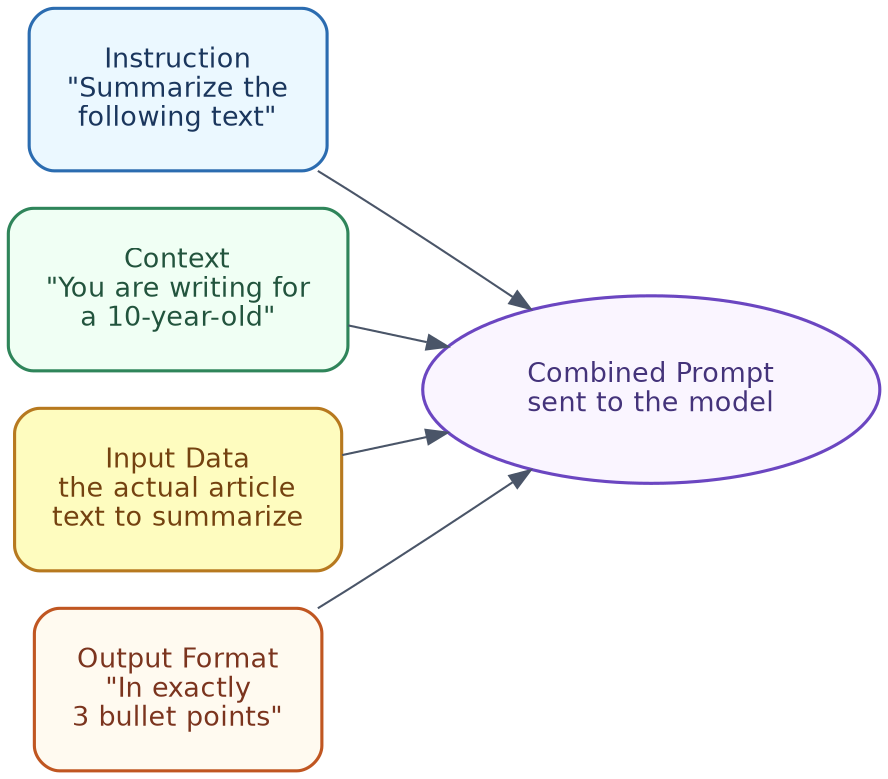

# Prompt Engineering Handbook
### A Short, Practical Guide to the Techniques You Will Actually Use

---

## Table of Contents

1. What is Prompt Engineering?
2. Anatomy of a Good Prompt
3. System Prompt vs. User Prompt
4. The Core Techniques
5. Structuring Prompts for Reliability
6. Common Mistakes to Avoid
7. Quick Hands-On Lab
8. Cheat Sheet / What to Do Next

---

## 1. What is Prompt Engineering?

Prompt engineering is basically the practice of wording your input properly, so a generative AI model gives you a better, more reliable answer — without changing the model itself.

**Same model, different results:**

| Prompt | Result quality |
|---|---|
| "Tell me about electric cars." | Vague, generic, length keeps changing |
| "List 3 pros and 3 cons of electric cars, in bullet points, under 100 words." | Specific, consistent, usable right away |

Nothing about the model changed between these two prompts. Only the wording changed. That gap is exactly what prompt engineering closes.

### In terms of tools you already know

You have probably done this already, without calling it "prompt engineering." When you ask **ChatGPT** or **Claude** a vague question and get a vague answer, and then you add more detail and suddenly get a much better answer — that improvement is prompt engineering, happening in real time. Even **Cursor** works this way: a vague instruction like "make this better" gives a weak code change, but "refactor this function to handle null values, and add a comment explaining why" gives a far more useful result.

---

## 2. Anatomy of a Good Prompt

Most good prompts are made up of up to four parts. You do not always need all four, but knowing them helps you figure out why a prompt is not working well.



| Part | What it does | Example |
|---|---|---|
| **Instruction** | What you want done | "Summarize the following text" |
| **Context** | Background that shapes the response | "You are writing for a 10-year-old" |
| **Input data** | The actual content to work on | The article, code, or data itself |
| **Output format** | How the answer should look | "In exactly 3 bullet points" |

**Combined example:**
```
You are writing for a 10-year-old. Summarize the following text in exactly
3 bullet points:

"[article text goes here]"
```

### In terms of tools you already know

When you paste code into **Cursor** and say "explain this function to me like I am new to this codebase," you are giving it context (new to this codebase) and an instruction (explain), even without input data written separately — Cursor is already looking at the code as the input. In **Claude Projects**, or when giving **ChatGPT** custom instructions, you are basically setting the "context" part once, so you do not need to repeat it in every single message.

---

## 3. System Prompt vs. User Prompt

| Type | Purpose | Example |
|---|---|---|
| **System prompt** | Sets behaviour for the whole conversation, usually set once by the developer | "You are a helpful support agent. Always be polite and concise." |
| **User prompt** | The specific question or request, each time | "My order hasn't arrived yet, what do I do?" |

**Why this matters:** The system prompt is where you bake in consistent rules (tone, role, boundaries), so you do not have to repeat them in every single user message.

### In terms of tools you already know

When you open **Cursor**'s settings and add "rules" for how it should write code (for example, "always use TypeScript, always add comments"), that is a system prompt, set once, applying to every request after that. **ChatGPT's "Custom Instructions"** and **Claude's "Custom Styles" or Project instructions** work exactly the same way — you set it once, and it quietly shapes every answer after that, without you needing to repeat yourself.

---

## 4. The Core Techniques

These five cover the large majority of real-world prompting needs.


### 4.1 Zero-shot prompting
Just ask directly, no examples given.
```
Classify the sentiment: "The food was cold and the service was slow."
```
Good for simple, common tasks the model already handles well.

### 4.2 Few-shot prompting
Show 2-3 examples of the pattern you want, before the real request.
```
Review: "Amazing food, great service!" → Positive
Review: "Terrible experience, never going back." → Negative
Review: "The food was cold and the service was slow." →
```
Use this when you need a specific format, or the task is a bit unusual.

### 4.3 Chain-of-thought prompting
Ask the model to reason step-by-step before giving a final answer — this improves accuracy on anything multi-step.
```
A store had 120 apples. They sold 45 in the morning and 30 in the afternoon.
How many are left? Think step by step before giving the final answer.
```

### 4.4 Role / persona prompting
Assign the model a role, to shape tone and depth.
```
You are an experienced financial advisor. Explain compound interest to a
16-year-old in simple terms.
```

### 4.5 Format, length, and tone constraints
Be explicit about what the output should look like.
```
Summarize this article in exactly 3 sentences, in a neutral tone, avoiding jargon.
```

**Simple rule of thumb:** Start with zero-shot. If the output is inconsistent, add few-shot examples. If it is getting facts or logic wrong, add chain-of-thought. Always add format constraints, if you need a predictable structure.

### In terms of tools you already know

- **Few-shot prompting** is what you are doing when you paste 2-3 example commit messages into **Cursor** and say "write a commit message in this style" — you are showing the pattern, not just describing it.
- **Chain-of-thought** is basically what **ChatGPT's reasoning models** and **Claude's extended thinking mode** already do on their own, before answering a hard question — you can often expand and read this thinking step yourself.
- **Role prompting** is exactly what happens when you tell **Claude**, "act as a strict code reviewer," before asking it to check your code — the tone and strictness of the review changes noticeably.

---

## 5. Structuring Prompts for Reliability

### Use delimiters to separate instructions from data

Without a clear separator, the model can get confused between your instructions and the content you gave it — this becomes a bigger problem with longer inputs.
```
Summarize the text between the triple quotes in 2 sentences.

"""
[article text goes here]
"""
```
Triple quotes, markdown headers, or tags like `<text>...</text>` all work fine — just pick one, and use it consistently.

### Ask for structured output directly
```
Extract the name, date, and total from this receipt. Return it as JSON with
keys "name", "date", and "total".
```
This is far more reliable than asking for the same information "in a sentence," and then trying to parse it yourself afterward.

### Use negative constraints

Sometimes it is easier to say what NOT to do.
```
Summarize this article. Do not include any opinions, only factual statements
from the text.
```

### In terms of tools you already know

When you paste a big error log into **ChatGPT** or **Claude** and wrap it in triple backticks before asking your question, you are using a delimiter, exactly as described above — this stops the model from confusing the error log with your actual instructions. **Cursor** does this automatically for you behind the scenes, whenever it includes your code as context along with your instruction, keeping the two cleanly separated.

---

## 6. Common Mistakes to Avoid

| Mistake | What goes wrong | Fix |
|---|---|---|
| **Vague instructions** | "Make this better" — the model has to guess what "better" means | Be specific: "make this more concise," or "make this more formal" |
| **Overloading one prompt** | Asking for a summary, translation, and sentiment analysis, all in one go, often makes all three worse | Split into separate prompts, or clearly numbered steps |
| **Assuming memory** | Referring to "that document," without actually including it | Always include the actual content the model needs, every single time |
| **Prompt injection** | If you paste in untrusted text (like a scraped webpage), it may contain hidden instructions that hijack the model's behaviour | Treat pasted-in external content as data, not instructions; keep instructions and untrusted content clearly separated using delimiters |

### In terms of tools you already know

If you have ever asked **ChatGPT** or **Claude** to "fix my resume," and got a generic, unhelpful answer, that is the "vague instructions" mistake in action — asking instead "make this resume more concise, and highlight my leadership experience for a manager role" works far better. If you have asked **Cursor** to "fix the bug, refactor the whole file, and also add tests" all in a single message, and it did a mediocre job at all three, that is the "overloading one prompt" mistake — breaking that into three separate requests usually gives much better results for each one.

---

## 7. Quick Hands-On Lab

A short script comparing zero-shot, few-shot, and chain-of-thought, side-by-side, on the same task, using a free local LLM (Ollama — no API key, no cost).

**Setup:**
```bash
brew install ollama
ollama pull llama3.1
pip install requests
```

**The script:**
```python
"""
compare_prompts.py — runs the same underlying task through three
different prompting techniques and prints each result for comparison.
"""

import requests

OLLAMA_URL = "http://localhost:11434/api/generate"
MODEL = "llama3.1"


def generate(prompt: str) -> str:
    response = requests.post(
        OLLAMA_URL,
        json={"model": MODEL, "prompt": prompt, "stream": False},
        timeout=120,
    )
    response.raise_for_status()
    return response.json()["response"]


review = "The food was cold and the service was slow."

zero_shot = f'Classify the sentiment of this review: "{review}"'

few_shot = f"""Review: "Amazing food, great service!" -> Positive
Review: "Terrible experience, never going back." -> Negative
Review: "{review}" ->"""

chain_of_thought = (
    f'Classify the sentiment of this review, thinking step by step about '
    f'the tone before giving a final one-word answer: "{review}"'
)

print("--- Zero-shot ---")
print(generate(zero_shot))

print("\n--- Few-shot ---")
print(generate(few_shot))

print("\n--- Chain-of-thought ---")
print(generate(chain_of_thought))
```

Run it with `python3 compare_prompts.py`, and compare the three outputs — notice how few-shot tends to give back a clean, single-word label, while chain-of-thought shows its reasoning first, before the final answer.

---

## 8. Cheat Sheet / What to Do Next

| If you need... | Use... |
|---|---|
| A quick, simple answer | Zero-shot |
| Consistent formatting, or an unusual pattern | Few-shot |
| Better accuracy on multi-step reasoning | Chain-of-thought |
| Consistent tone or depth of expertise | Role/persona prompting |
| A specific structure, every time | Explicit output format instructions |
| To process long or untrusted text safely | Delimiters, separating instructions from data |

**What to do next:**
- Try the lab in Section 7, and swap in your own task.
- Next time you use ChatGPT, Claude, or Cursor, notice which technique from Section 4 you are actually using, without realising it — this is the fastest way to get better at prompting.
- Read the Generative AI Fundamentals Handbook's section on RAG — grounding prompts in real data is the natural next step, once these basics feel comfortable.
- If you start building multi-step or tool-using prompts regularly, that is the point where it is worth exploring agents (covered in the Agentic AI Handbook).

---

*End of Handbook*
