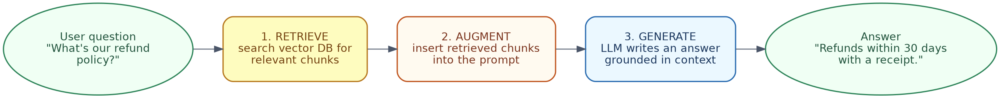
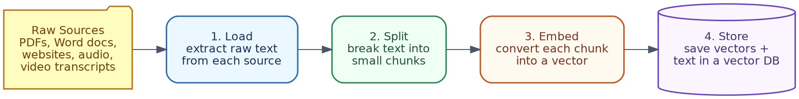
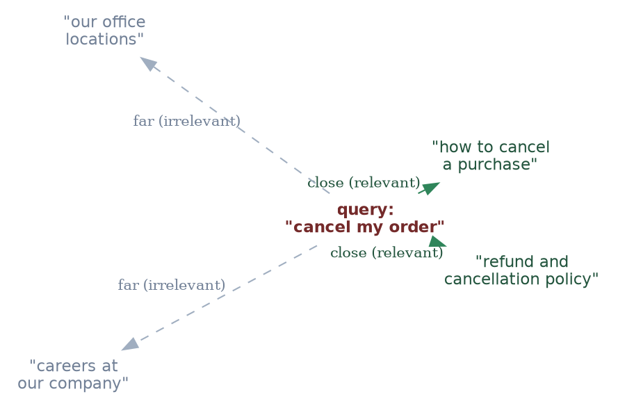
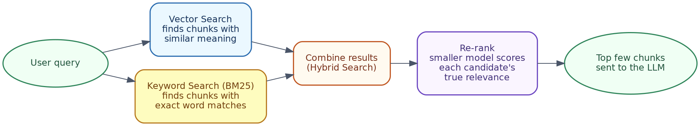
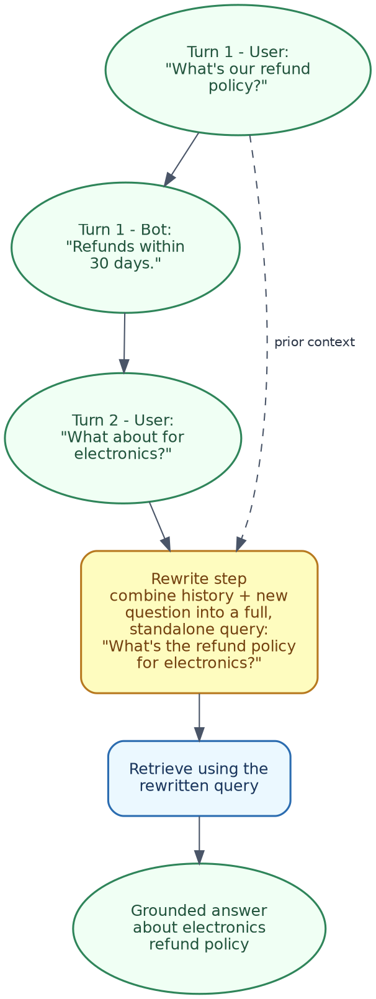
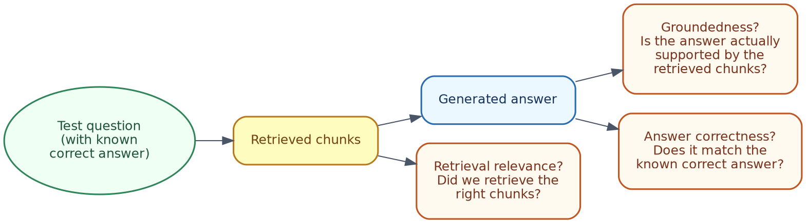
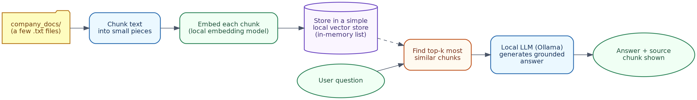

# RAG & Vector Databases Handbook
### A Simple, Detailed Guide to Retrieval-Augmented Generation, with Examples and a Hands-On Lab

---

## Table of Contents

1. What is RAG? (Quick Recap and Why It Is Important)
2. The RAG Pipeline, Step by Step
3. Document Loading
4. Document Splitting / Chunking
5. What is a Vector Database? Plus Embeddings
6. Popular Vector Database Options
7. Retrieval — Basic, Hybrid, and Re-ranking
8. Question Answering (One-Shot RAG)
9. Chat — Adding Conversation Memory to RAG
10. Common Mistakes to Avoid
11. Checking if Your RAG System is Good (Evaluation)
12. Quick Hands-On Lab
13. Cheat Sheet / What to Do Next

---

## 1. What is RAG? (Quick Recap and Why It Is Important)

**In one line:**
> RAG (Retrieval-Augmented Generation) is a method where we give the LLM some extra, relevant information at the time of the question, instead of only depending on what it learned during training.

**Why this is needed:** LLMs have two limitations. One, they only know information up to a certain date. Two, they have no idea about your company's private documents. RAG solves both problems by fetching the correct information just before generating the answer.

**Without RAG:**
```
User: "What is our company's refund policy?"
LLM:  (has never seen this document, so it will guess, or simply say it does not know)
```

**With RAG:**
```
User:   "What is our company's refund policy?"
System: fetches the actual refund policy document, adds it to the prompt
LLM:    "Refunds are accepted within 30 days of purchase, with a receipt."
```

In this handbook, we will go in detail into how this "fetching" step actually works — and that is where vector databases and embeddings come into the picture.

### In terms of tools you already know

When you upload a PDF to **ChatGPT** or **Claude**, and ask a question about it, RAG is exactly what is happening — the model reads your document, and grounds its answer in it, instead of guessing from general training data. **Claude Projects**, where you attach documents once and ask many questions over time, is basically a small, ready-made RAG system, built right into the product for you.

---

## 2. The RAG Pipeline, Step by Step



| Step | What happens |
|---|---|
| **1. Retrieve** | The user's question is used to search for relevant pieces of text from a knowledge source |
| **2. Augment** | These retrieved pieces are added into the prompt, along with the original question |
| **3. Generate** | The LLM writes the answer, based on this added context |

The rest of this handbook explains, in detail, everything that must happen *before* Step 1 can work properly (loading, splitting, embedding, storing), and everything you can do to make Steps 1 to 3 more reliable (hybrid search, re-ranking, evaluation).

---

## 3. Document Loading

Before anything can be retrieved, your source material has to first be converted into plain text that the system can use. This step is called **document loading**. In real projects, data rarely comes in one single, clean format — so this step needs a bit of care.

### Common source types and how they are loaded

| Source type | Challenge | Usual approach |
|---|---|---|
| **Plain text / Markdown** | Simplest case | Just read the file directly |
| **PDF** | Text may come out jumbled, especially with tables or columns | Use a PDF text-extraction tool; scanned PDFs need OCR first |
| **Word documents** | Formatting, headers, footers, images can create noise | Extract the text while keeping paragraph structure intact |
| **Websites / HTML** | Menus, ads, and other clutter mixed with the real content | Remove HTML tags, keep only the main content |
| **Audio / video** | No text at all to begin with | First transcribe using speech-to-text, then treat the transcript as normal text |
| **Spreadsheets / CSVs** | Data is structured, not written in sentences | Usually converted row by row into short text descriptions |

**Simple example:** Suppose a company wants its product manuals (PDFs), support call recordings (audio), and FAQ page (website) to all be searchable through one chatbot. Each source type needs its own loading method, but in the end, all three should look the same: **plain text, along with some metadata** (like file name, page number, or timestamp).

### Why metadata is important at this stage

If you lose track of *where* a piece of text came from during loading, it becomes much harder to show the source later (Section 8) or filter results (Section 7).

**Good practice:**
```python
{
    "text": "Refunds are accepted within 30 days...",
    "source": "refund_policy.pdf",
    "page": 1
}
```
If you carry this metadata through every later step (chunking, embedding, storing), it becomes possible to answer "where did this answer come from" at the end.

### In terms of tools you already know

When you upload multiple files to **ChatGPT** or **Claude** in one conversation, and then ask "which document did this come from," the app is relying on exactly this kind of metadata, quietly carried along behind the scenes, since the very first loading step.

---

## 4. Document Splitting / Chunking

### Why you cannot simply put the whole document in

There are two main reasons:
1. **Context window limit** — a full book will simply not fit inside one prompt.
2. **Retrieval accuracy** — if you treat an entire 50-page manual as one single unit, then even a small search like "return policy" will fetch the *entire manual*, and most of it will be irrelevant for the LLM to go through.

Chunking means breaking documents into smaller, focused pieces, so that retrieval can find *only* the relevant part.

### Chunk size — the trade-off



| Chunk size | Advantage | Disadvantage |
|---|---|---|
| **Too small** (for example, single sentences) | Very precise matching | Loses the surrounding context; answers can feel incomplete |
| **Too large** (for example, whole pages) | Keeps full context together | Retrieval becomes less accurate; wastes prompt space on irrelevant text |
| **Balanced** (commonly around 200-500 words, or a few paragraphs) | Good mix of accuracy and context | Needs some testing to get right for your use case |

**Simple example:**
```
Original document (one paragraph):
"Refunds are accepted within 30 days of purchase, as long as the item
is unused and you have a receipt. Shipping costs are non-refundable.
Exchanges follow the same 30-day window."

Chunk 1: "Refunds are accepted within 30 days of purchase, as long as
          the item is unused and you have a receipt."
Chunk 2: "Shipping costs are non-refundable. Exchanges follow the same
          30-day window."
```

### Overlap between chunks

Many chunking methods keep a small **overlap** between chunks (for example, the last line of one chunk is repeated as the first line of the next one), so that information sitting right at the boundary does not get cut off awkwardly.

```
Chunk 1: "...as long as the item is unused and you have a receipt."
Chunk 2: "...you have a receipt. Shipping costs are non-refundable..."
                                    ^ overlap
```

---

## 5. What is a Vector Database? Plus Embeddings

### Simple way to understand it

A normal database search (like SQL) finds **exact matches** only. If you search "cancel," it will not find a document that says "terminate my subscription," even though both mean almost the same thing.

A **vector database** searches by **meaning** instead. It stores documents as numbers ("embeddings") that capture the meaning of the text, so a search for "cancel my order" can find "terminate my subscription" too, even with no common words between them.

### What exactly is an embedding?

An embedding is simply a list of numbers that represents the *meaning* of a piece of text, generated by a special model. Texts with similar meaning end up with embeddings that sit close to each other, mathematically speaking.

**Simple picture:**



In this simple picture, the query "cancel my order" ends up close to text about cancellation and refunds, and far away from unrelated text about office locations or careers — even though there is no exact word match.

### How "similarity" is measured (just the basic idea)

Most systems use something called **cosine similarity** — a way to check how closely two sets of numbers "point in the same direction." You do not really need to know the maths behind it to use it well:

| Similarity score | What it means |
|---|---|
| Close to 1.0 | Meaning is very similar |
| Close to 0.0 | Not related |
| Close to -1.0 | Opposite meaning (rare for text) |

**Simple example:**
```
embed("cancel my order")  ≈ embed("terminate my subscription")   → high similarity
embed("cancel my order")  ≈ embed("what are your office hours")  → low similarity
```

### What a vector database actually does

For every chunk, it stores:
- The original text (plus metadata such as source and page)
- Its embedding (the list of numbers)

When you run a search, the database:
1. Converts your query into an embedding, the same way
2. Compares this query embedding with every stored embedding
3. Returns the closest matches (this is the "retrieve" step from Section 2)

### In terms of tools you already know

You cannot see this happening directly, but every time you attach a document to **Claude** or **ChatGPT**, and ask a question about a specific part of it, something similar to this embedding-and-comparing process is running in the background, to find the right passage to base the answer on.

---

## 6. Popular Vector Database Options

*Please note: this space keeps changing quite fast, so treat this table as a general idea of well-known options, not an up-to-date feature comparison.*

| Option | Type | Good for |
|---|---|---|
| **FAISS** | Library (not a complete database) | Quick, local testing, no server setup needed |
| **Chroma** | Lightweight, open-source | Small to medium projects, easy to set up locally |
| **Pinecone** | Managed cloud service | Production apps that want a fully managed, scalable option |
| **Weaviate** | Open-source, can be self-hosted or managed | Projects that want built-in hybrid search and filtering |
| **pgvector** | An extension for PostgreSQL | Teams already using Postgres who want vector search without adding new infrastructure |

**Simple guidance:**
- Just experimenting on your own? Start with **FAISS** or **Chroma**.
- Already using Postgres? **pgvector** is the easiest add-on.
- Building something for production, at scale? A managed option like **Pinecone** or **Weaviate** will reduce your operational headache.

---

## 7. Retrieval — Basic, Hybrid, and Re-ranking

### Basic retrieval (vector / semantic search)

This is the simple approach explained in Section 5 — convert the query into an embedding, find the closest chunks by similarity, and that's it. This is called **top-k retrieval**, meaning you ask for the *k* best matches (say, top 3 or top 5).

### Where pure vector search falls short

Vector search is very good at understanding *meaning*, but it can sometimes miss **exact matches** — like a product code, an acronym, or a specific name — because these do not always carry a strong "meaning" the way normal sentences do.

**Simple example:** A user searches for "error code E4521." In meaning, this may not closely match the actual support document title, but a plain keyword search would find it right away.

### Hybrid search

Hybrid search combines **keyword search** (the traditional exact-match method, often using something called BM25) with **vector search**, and then merges both results — giving you the benefit of both approaches.



| Search type | Good at | Weak at |
|---|---|---|
| **Vector (semantic)** | Meaning, paraphrasing, related ideas | Exact codes, names, rare terms |
| **Keyword (BM25)** | Exact matches, specific terms | Text that is paraphrased or only conceptually related |
| **Hybrid (both)** | Covers both situations | Slightly more effort to set up |

### Re-ranking

Even with hybrid search, sometimes the retrieved list is not perfectly ordered — the *most* relevant result may not be sitting at the top. **Re-ranking** adds one more step: a smaller, more precise model checks each candidate again for how relevant it really is to the query, and reorders the list before it goes to the LLM.

**Simple example:**
```
Initial retrieval (top 5, by rough similarity):
1. "Shipping costs are non-refundable"          (score 0.81)
2. "Refunds are accepted within 30 days"        (score 0.79)
3. "Exchanges follow the same 30-day window"    (score 0.75)
...

After re-ranking, for the specific query "how do I get a refund?":
1. "Refunds are accepted within 30 days"        (re-rank score 0.95)
2. "Exchanges follow the same 30-day window"    (re-rank score 0.60)
3. "Shipping costs are non-refundable"          (re-rank score 0.40)
```
So basically, the first retrieval step got the right chunks into the list. Re-ranking simply made sure the *most* useful one lands at the top, in the small set that finally goes to the LLM.

**When should you bother with hybrid search and re-ranking?** If your basic vector search is already giving good answers, you may not need either one. Add hybrid search when you notice exact terms getting missed, and add re-ranking when the right chunks are being retrieved but in the wrong order.

### In terms of tools you already know

If you have ever asked **ChatGPT** or **Claude** about an exact error code, or a very specific product name, from an attached document, and it missed it initially, that is often a pure-vector-search limitation, exactly like the one described above. This is one reason production RAG systems (built on top of these same models) often add hybrid search and re-ranking, even though a simple chat upload may only be doing plain vector search underneath.

---

## 8. Question Answering (One-Shot RAG)

This is the most common and simplest RAG use case — one question comes in, one grounded answer goes out, with no conversation history involved.

### A full example

```
User question: "What is your shipping policy?"

Step 1 (retrieve): finds the chunk "Standard shipping takes 5-7 business
        days. Express shipping takes 1-2 business days for an additional fee."

Step 2 (augment): the prompt now becomes:
        "Answer using only this context: 'Standard shipping takes 5-7
        business days. Express shipping takes 1-2 business days for an
        additional fee.' Question: What is your shipping policy?"

Step 3 (generate): "Standard shipping takes 5-7 business days, or you can
        choose express shipping (1-2 business days) for an extra fee."
```

### Showing the source

A very common, practical requirement is to show *where* the answer came from, not just the answer alone. Since we already carried the metadata forward from Section 3, adding this is quite simple.

**Simple example, with source shown:**
```
Answer: "Standard shipping takes 5-7 business days, or express shipping
         (1-2 business days) for an extra fee."
Source: shipping_policy.pdf, page 1
```

**Why this matters:** It lets users (or your own team) go back and check the answer against the real document, and it builds more trust in the whole system — this becomes especially important for topics like legal, medical, or financial information.

### In terms of tools you already know

When **Claude** or **ChatGPT** quotes a specific line from an uploaded PDF, and tells you roughly where it found it, that is this exact citation pattern, showing up in a product you already use.

---

## 9. Chat — Adding Conversation Memory to RAG

One-shot question answering starts to break down the moment a user asks a **follow-up question** that depends on what was said earlier.

### The problem

```
Turn 1 — User: "What is our refund policy?"
Turn 1 — Bot:  "Refunds within 30 days."
Turn 2 — User: "What about for electronics?"
```
If you simply take "What about for electronics?" and search with it directly, the system has no way of knowing this question is still about refunds — the question alone is too vague on its own.

### The fix — rewriting the question first

Before doing retrieval, we add one extra step, where the conversation history is used to rewrite the latest question into a full, standalone version.



**Simple example:**
```
History: [User: "What is our refund policy?", Bot: "Refunds within 30 days."]
New question: "What about for electronics?"

Rewritten, standalone question: "What is the refund policy for electronics?"
```
This rewritten question is what actually gets converted into an embedding and searched — this solves the ambiguity problem quite nicely.

### Simple pseudocode for this flow

```python
def chat_rag(question, history):
    if history:
        standalone_question = rewrite_with_history(question, history)
    else:
        standalone_question = question

    chunks = retrieve(standalone_question)
    answer = generate_with_context(standalone_question, chunks)

    history.append((question, answer))
    return answer
```

**Why this matters in practice:** Without this step, a RAG-based chatbot will feel quite broken the moment someone asks a natural follow-up question — and in most real conversations, that is exactly what happens.

### In terms of tools you already know

This is exactly why you can ask **Claude** or **ChatGPT** a follow-up question like "what about for electronics," right after asking about a document's refund policy, and it still understands what you mean — the conversation memory feature in these products is handling this same rewriting step for you, quietly, behind the scenes.

---

## 10. Common Mistakes to Avoid

| Mistake | What goes wrong | How to fix |
|---|---|---|
| **Bad chunking** | Chunks are too big (irrelevant text drowns the real answer) or too small (loses context) | Try a few different chunk sizes against real questions; add some overlap |
| **Irrelevant retrieval** | The right document exists, but is not retrieved, usually due to a mismatch in wording | Add hybrid search (Section 7) |
| **Old, stale embeddings** | Source documents get updated, but the vector database still holds embeddings of the old version | Re-embed and re-index every time source documents change |
| **Skipping re-ranking** | Right chunks get retrieved, but the most useful one is not at the top, and may get pushed out or cut off | Add a re-ranking step (Section 7) |
| **Garbage in, garbage out** | The quality of retrieval directly decides the quality of the generated answer — no amount of clever prompting can fix bad retrieved context | Focus on good loading, chunking, and retrieval quality *before* worrying too much about prompt wording |
| **No conversation rewriting** | Follow-up questions fetch irrelevant chunks, because the question alone is too vague | Add the query rewriting step (Section 9) |

---

## 11. Checking if Your RAG System is Good (Evaluation)

Once your RAG system is built, the practical question is: **is it actually working well?** Evaluation usually checks three separate things.



| Check | Question it answers | Simple example |
|---|---|---|
| **Retrieval relevance** | Did we fetch the right chunks in the first place? | For the question "what is the refund policy," was the refund policy chunk actually present in the top results? |
| **Groundedness (faithfulness)** | Is the generated answer really based on the retrieved chunks, or did the model add something extra on its own? | If the retrieved chunk says "30 days" but the answer says "60 days," this is a groundedness failure — the model made something up, even though it had the correct context |
| **Answer correctness** | Does the final answer match what is actually correct, from a human point of view? | Comparing the generated answer against a known, correct answer for a test question |

### A simple way to evaluate manually

You do not need any complicated framework to get started:
1. Write out 10-20 realistic test questions, along with their known correct answers.
2. Run each one through your RAG system.
3. For each, check: were the right chunks retrieved? Does the answer actually match what the chunks say? Is the final answer correct?
4. Keep a simple pass/fail count — this alone will catch most chunking, retrieval, and hallucination issues early on.

**Why this matters:** Without evaluation, you are basically guessing whether any change you make (a new chunk size, a new embedding model, adding re-ranking) is actually helping or not. Evaluation turns that guesswork into something you can actually measure.

---

## 12. Quick Hands-On Lab

Here is a complete, working RAG pipeline — chunk, embed, store, retrieve, generate — using entirely free, local tools through Ollama. No API key needed, no cost involved.

### What you will build



### Step 1 — Install what you need

```bash
brew install ollama
ollama pull llama3.1            # for generating answers
ollama pull nomic-embed-text    # a free local embedding model

pip install requests numpy
```

### Step 2 — The full pipeline (`rag_demo.py`)

```python
"""
rag_demo.py — a minimal, complete RAG pipeline:
chunk -> embed -> store -> retrieve -> generate,
using a free local LLM and embedding model via Ollama.
"""

import numpy as np
import requests

OLLAMA_GENERATE_URL = "http://localhost:11434/api/generate"
OLLAMA_EMBED_URL = "http://localhost:11434/api/embeddings"
GEN_MODEL = "llama3.1"
EMBED_MODEL = "nomic-embed-text"

company_docs = [
    "Refund Policy: Refunds are accepted within 30 days of purchase, as long "
    "as the item is unused and you have a receipt.",
    "Shipping Policy: Standard shipping takes 5-7 business days. Express "
    "shipping takes 1-2 business days for an additional fee.",
    "Warranty Policy: All electronics come with a 1-year manufacturer "
    "warranty covering defects, but not accidental damage.",
]


def chunk_text(text: str, max_words: int = 40) -> list[str]:
    """Split text into chunks of roughly max_words words each."""
    words = text.split()
    return [
        " ".join(words[i:i + max_words])
        for i in range(0, len(words), max_words)
    ]


def embed(text: str) -> np.ndarray:
    """Get an embedding vector for a piece of text from the local model."""
    response = requests.post(
        OLLAMA_EMBED_URL,
        json={"model": EMBED_MODEL, "prompt": text},
        timeout=60,
    )
    response.raise_for_status()
    return np.array(response.json()["embedding"])


def cosine_similarity(a: np.ndarray, b: np.ndarray) -> float:
    return float(np.dot(a, b) / (np.linalg.norm(a) * np.linalg.norm(b)))


def generate(prompt: str) -> str:
    response = requests.post(
        OLLAMA_GENERATE_URL,
        json={"model": GEN_MODEL, "prompt": prompt, "stream": False},
        timeout=120,
    )
    response.raise_for_status()
    return response.json()["response"]


# --- Step 1 & 2: Chunk and build the vector store (a simple in-memory list) ---
vector_store = []  # each item: {"text": ..., "vector": ...}

for doc in company_docs:
    for chunk in chunk_text(doc):
        vector_store.append({"text": chunk, "vector": embed(chunk)})

print(f"Indexed {len(vector_store)} chunks.\n")


# --- Step 3: Retrieve top-k most similar chunks for a query ---
def retrieve(query: str, k: int = 2) -> list[dict]:
    query_vector = embed(query)
    scored = [
        {**item, "score": cosine_similarity(query_vector, item["vector"])}
        for item in vector_store
    ]
    scored.sort(key=lambda x: x["score"], reverse=True)
    return scored[:k]


# --- Step 4: Augment + Generate ---
def answer(query: str, k: int = 2) -> str:
    top_chunks = retrieve(query, k)
    context = "\n".join(f"- {c['text']}" for c in top_chunks)

    prompt = (
        "Answer the question using only the context below. If the context "
        "doesn't contain the answer, say you don't know.\n\n"
        f"Context:\n{context}\n\nQuestion: {query}\nAnswer:"
    )

    result = generate(prompt)

    print(f"Q: {query}")
    print("Retrieved chunks:")
    for c in top_chunks:
        print(f"  [{c['score']:.2f}] {c['text']}")
    print(f"\nA: {result}\n")
    return result


if __name__ == "__main__":
    answer("What's your refund policy?")
    answer("How long does shipping take?")
    answer("Do you cover water damage under warranty?")
```

### Step 3 — Run it

```bash
python3 rag_demo.py
```

You should see each question, the retrieved chunks along with their similarity scores, and a grounded final answer — including for the last question, where a good answer should say the context does not clearly mention "water damage" (this is a good test to check whether the model is sticking to what it was given, instead of just guessing).

### Step 4 — Try these next

- **Try changing chunk size:** change `max_words` inside `chunk_text()` and see how the retrieval scores change.
- **Try changing k:** increase `k` in `retrieve()` to pull more chunks, and see if answer quality changes.
- **Try an out-of-scope question:** ask something that is not covered by any document (for example, "What is your return policy for pets?") and check that the model says it does not know, instead of making something up.
- **Add a simple evaluation (Section 11):** write 5 test questions with known answers, run them through `answer()`, and manually check retrieval relevance and groundedness.

### What is happening behind the scenes (mapped to earlier sections)

| Piece | Concept | Section |
|---|---|---|
| `company_docs` list | Document loading (simplified — already plain text) | Section 3 |
| `chunk_text()` | Document splitting | Section 4 |
| `embed()` | Embeddings | Section 5 |
| `vector_store` list | A minimal vector database | Section 5, 6 |
| `cosine_similarity()` + `retrieve()` | Basic (vector) retrieval | Section 7 |
| the "using only the context below" instruction | Augmentation, and guarding against hallucination | Section 2, 10 |
| printing retrieved chunks with scores | A simple way to eyeball retrieval relevance | Section 11 |

### A few notes and troubleshooting tips

- If embedding calls feel slow, remember `nomic-embed-text` is a lightweight model — but for very large document sets, you would need a real vector database (Section 6), not just a plain Python list.
- If answers seem ungrounded, double-check that the prompt is actually carrying the retrieved context — simply print it out before sending, to confirm.
- This lab skips hybrid search, re-ranking, and conversation memory, to keep things short — Sections 7 and 9 explain how you could extend it further with those.

---

## 13. Cheat Sheet / What to Do Next

| If you need... | Use... |
|---|---|
| To make many file types searchable | A loader for each source type (Section 3) |
| Better retrieval accuracy | Smaller chunks, with some overlap (Section 4) |
| Search by meaning, not just exact words | Vector search plus embeddings (Section 5) |
| To also catch exact terms or codes | Hybrid search (Section 7) |
| The most relevant chunk to actually come first | Re-ranking (Section 7) |
| Users to trust and verify the answers | Show sources using metadata (Section 8) |
| Natural follow-up questions to work properly | Query rewriting using conversation history (Section 9) |
| To know if your changes are actually helping | A simple manual evaluation set (Section 11) |

**What to do next:**
- Try running the Hands-On Lab in Section 12, and try it with your own small set of documents.
- Once you are comfortable, go back to the Prompt Engineering Handbook's section on structuring prompts (delimiters, output format) — it applies directly to the "augment" step covered here.
- If you also want the system to take actions (not just answer questions), that is where RAG connects with the Agents section of the Generative AI Fundamentals Handbook.

---

*End of Handbook*
