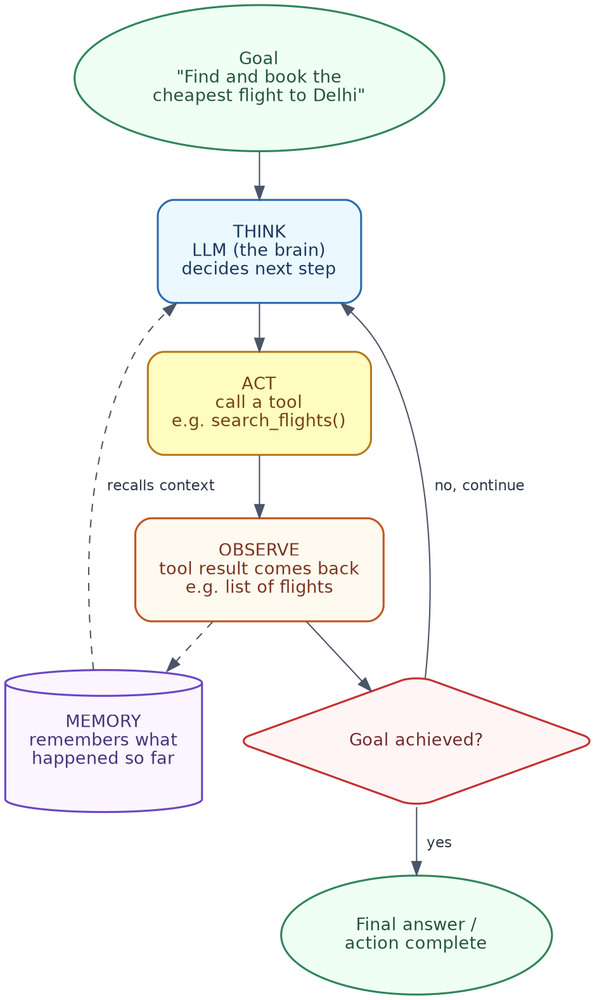
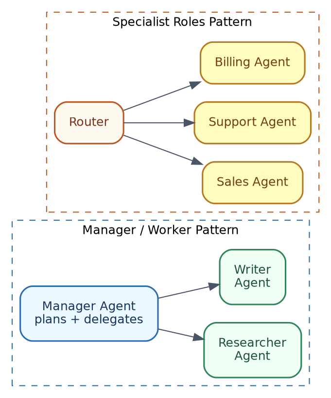
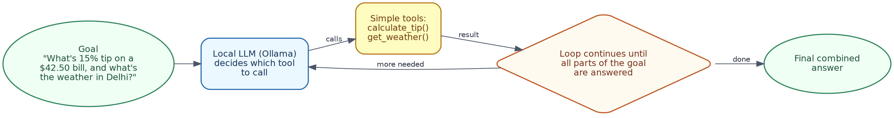

# Agentic AI Handbook
### A Detailed Guide to AI Agents, in Simple Indian English, with Examples and Hands-On Labs

---

## Table of Contents

1. What is Agentic AI? (Quick Recap and Why It Is Important)
2. Anatomy of an Agent
3. Tool Use / Function Calling
4. Planning and Task Decomposition
5. Memory in Agents
6. Popular Agent Frameworks (Brief, Factual Comparison)
7. Multi-Agent Systems
8. Agent Reasoning Patterns
9. Guardrails and Human-in-the-Loop
10. Common Mistakes to Avoid
11. Checking if an Agent is Good (Evaluation)
12. Quick Hands-On Lab (Free Local LLM)
13. Hands-On with Popular Frameworks
14. Cheat Sheet / What to Do Next

---

## 1. What is Agentic AI? (Quick Recap and Why It Is Important)

**In simple words:** A normal chatbot only generates text. An **agent** goes one step further — it can actually take actions, like calling an API, searching the web, or running some code, to complete a task.

### Chatbot vs. Agent

| | Chatbot | Agent |
|---|---|---|
| **Can it look things up?** | No, only uses what it already knows | Yes, it can call outside tools |
| **Can it take real actions?** | No | Yes (send an email, book something, query a database, and so on) |
| **Example** | "Delhi is the capital of India" (from memory) | "Let me check today's weather in Delhi" (calls a real weather tool) |

**Why this matters:** A chatbot is basically a good talker. An agent is a good doer. Once an LLM can decide *when* and *how* to call tools on its own, it stops being just a text generator, and starts becoming something that can complete real, multi-step tasks for you.

### In terms of tools you already know

- **ChatGPT (plain chat)** answering "what is the capital of France" from memory is a **chatbot** moment. ChatGPT with browsing turned on, actually searching the web for today's news, is behaving like an **agent**.
- **Claude (plain chat)** answering a question directly is a chatbot moment. Claude using a connected tool (for example, searching your Google Drive, or using the computer to run code) is agent behaviour.
- **Cursor** is a very good everyday example of an agent. When you ask it to "fix this bug," it does not just describe the fix in words — it actually opens the file, reads the code, edits it, and can even run your tests. That is the whole chatbot-to-agent shift, happening right inside your code editor.

---

## 2. Anatomy of an Agent

Every agent, no matter how simple or complex, is basically built from four parts, working together in a loop.



| Part | What it does |
|---|---|
| **Goal** | What the user actually wants done |
| **LLM (the "brain")** | Decides what to do next, at every step |
| **Tools** | Functions the agent can call to take action or fetch information |
| **Memory** | Keeps track of what has happened so far in the task |

### The core loop: Think → Act → Observe → Repeat

1. **Think:** the LLM looks at the goal and the memory so far, and decides the next step.
2. **Act:** it calls a tool, with the arguments it thinks are correct.
3. **Observe:** the tool sends back a result.
4. **Repeat:** the LLM checks if the goal is complete. If not, it goes back to thinking, using this new information.

**Simple example:**
```
Goal: "Find and book the cheapest flight to Delhi."

Think:   I need current flight prices, which I do not have memorised.
Act:     search_flights(destination="Delhi")
Observe: a list of flights with prices comes back
Think:   the cheapest one is flight AI202 at ₹6,200
Act:     book_flight(flight_id="AI202")
Observe: booking confirmed
Final:   "Booked! Flight AI202, ₹6,200, departs 9 AM."
```

### In terms of tools you already know

This exact loop is what runs, behind the scenes, when you give **Cursor** a task like "add error handling to this function." Cursor's agent:
- **Thinks:** decides it first needs to read the current file.
- **Acts:** opens and reads the file (a tool call).
- **Observes:** sees the actual code.
- **Thinks again:** decides what edit to make.
- **Acts:** writes the edit, maybe runs the tests too.
- **Repeats** until the task looks complete, then shows you the final diff.

**Claude with computer use, or Claude Code**, works the same way — deciding a step, taking an action (like running a command or editing a file), looking at what happened, and deciding the next step. **ChatGPT with Code Interpreter** follows this same loop too: think about what code to write, run it, look at the output, and decide whether to try again or move on.

---

## 3. Tool Use / Function Calling

This is the actual mechanism that lets an agent "act." The LLM is given a list of tools it is allowed to use, along with a description of what each tool does and what input it needs. The LLM then decides, on its own, when to call which tool, and with what arguments.

**Simple example of a tool definition (in plain words, not code):**
```
Tool name: get_weather
Description: Returns the current weather for a given city
Input needed: city (text)
```

When the user asks, "What is the weather in Mumbai," the LLM sees this tool is a good match, and calls it like this:
```
get_weather(city="Mumbai")
```

The tool runs, returns a result like "29°C, humid," and this result is fed back to the LLM, so it can form a proper, final answer.

**This connects directly with MCP (Model Context Protocol):** if you have read the MCP Handbook, you will notice this is exactly the same idea — an LLM deciding to call a tool, getting back a structured result, and using it in its final answer. MCP simply standardises *how* those tools are described and exposed to the model. This section (function calling) is about the model *deciding* to use them.

### In terms of tools you already know

- **ChatGPT's "Actions" (in Custom GPTs)** are exactly this — you describe a tool (an API), and ChatGPT decides when a user's question needs it.
- **Claude's tool use** works identically — you (or an app built on Claude) define tools like `get_weather`, and Claude decides when to call them, the same way described above.
- **Cursor** has a whole set of built-in tools it can call without you defining anything — "read file," "edit file," "run terminal command," "search codebase." When you ask Cursor to "find where this function is used," it is silently calling a "search codebase" tool behind the scenes, exactly like `get_weather(city="Mumbai")` above, just for code instead of weather.

---

## 4. Planning and Task Decomposition

Some tasks are simple enough for one tool call. Others need to be broken down into smaller steps first — this is called **task decomposition**.

### Single-step vs. multi-step agents

| Type | What it does | Example |
|---|---|---|
| **Single-step** | One question, one tool call, one answer | "What is the weather in Chennai?" → one weather tool call |
| **Multi-step** | Breaks a big goal into a series of smaller steps | "Plan a 3-day trip to Goa within ₹15,000" → needs flight search, hotel search, budget checking, all combined |

**Simple example of planning:**
```
Goal: "Plan a 3-day trip to Goa within ₹15,000."

Plan:
1. Search flights to Goa, note the price.
2. Search hotels in Goa for 3 nights, note the price.
3. Add both up, check if it is within ₹15,000.
4. If over budget, look for cheaper options and repeat step 3.
5. Present the final plan.
```

This planning step is what allows an agent to handle tasks a single prompt simply cannot manage in one shot.

### In terms of tools you already know

Ask **Cursor** to "migrate this project from JavaScript to TypeScript," and you can literally watch it plan: it lists out the files it needs to touch, then goes through them one by one, instead of trying to do everything in one giant, single step. That checklist you see appearing is task decomposition, happening live.

**ChatGPT** and **Claude**, when solving a harder, multi-part question (for example, "compare these three job offers and tell me which is best"), often also break it down internally — this becomes more visible when a model has an "extended thinking" or "reasoning" mode turned on, where you can actually see the intermediate planning steps, not just the final answer.

---

## 5. Memory in Agents

Memory is what allows an agent to "remember" things, either within one task, or across many sessions.

| Type | What it remembers | Example |
|---|---|---|
| **Short-term memory** | What has happened so far, in the current task or conversation | Remembering that the user already said their budget is ₹15,000, without asking again |
| **Long-term memory** | Information saved and available across different sessions, even after the app is closed and reopened | Remembering a user's preferred seat type ("aisle seat") from a previous booking, weeks later |

**Why this matters:** Without memory, an agent would forget its own previous steps within the same task, and keep repeating tool calls, or asking the same questions again and again. Long-term memory is what makes an agent feel like it is actually "learning" your preferences over time, instead of starting from zero every single time.

**Simple example:**
```
Session 1: User says, "I prefer aisle seats."
           (saved in long-term memory)

Session 2 (next week): User says, "Book me a flight to Pune."
           Agent automatically books an aisle seat, without being asked again.
```

### In terms of tools you already know

- **Short-term memory** is what you already experience inside any single **ChatGPT** or **Claude** conversation — it remembers what you said 3 messages ago, without you repeating it.
- **ChatGPT's "Memory" feature** (remembering facts about you across different chats, like your job or preferences) is a real example of **long-term memory** in an everyday product.
- **Cursor** keeps short-term memory of the current task (the files it has already read, the edits it has already made), and also uses your whole codebase as a kind of long-term, persistent context it can refer back to across a coding session.

---

## 6. Popular Agent Frameworks (Brief, Factual Comparison)

*Please note: this is a fast-changing space. Treat this table as a general, factual snapshot, not a permanent ranking.*

| Framework | Made by | Good for |
|---|---|---|
| **LangChain / LangGraph** | LangChain | Building agents as a graph of steps, with good support for complex, branching, or looping workflows |
| **AutoGPT** | Significant Gravitas | Originally a single-agent, fully autonomous framework; now mainly a hosted platform with a visual, drag-and-drop Agent Builder |
| **CrewAI** | CrewAI Inc. | Role-based, multi-agent systems, where agents are assigned specific roles and work together as a "crew" |
| **OpenAI Agents SDK** | OpenAI | A lightweight, official SDK for building agents, tools, and multi-agent handoffs, on top of OpenAI's models |
| **Microsoft AutoGen (AgentChat)** | Microsoft Research | Multi-agent systems where agents "talk" to each other, useful for research, data analysis, and human-in-the-loop workflows |

**Simple guidance:**
- Want fine control over each step, with branching logic? Go for **LangGraph**.
- Want a no-code way to try agents quickly? Try the **AutoGPT** hosted platform.
- Want agents playing different "roles" in a team? **CrewAI** is built exactly for that.
- Already using OpenAI's models, and want something official and lightweight? Use the **OpenAI Agents SDK**.
- Want agents that "converse" with each other to solve a problem, with strong human-in-the-loop support? **AutoGen** is a good fit.

Section 13 gives a proper hands-on example for each one of these.

### In terms of tools you already know

The **OpenAI Agents SDK** is built by the same company that makes **ChatGPT** — it is literally the framework OpenAI uses internally for a lot of its own agent-style features. Several of these frameworks (LangGraph, CrewAI, AutoGen) also work perfectly well with **Claude** models instead of OpenAI's, since most are model-agnostic by design — you are free to plug in whichever LLM you prefer underneath.

---

## 7. Multi-Agent Systems

Sometimes, one agent trying to do everything is not the best design. Multi-agent systems split the work between several smaller, more focused agents.



### Common patterns

| Pattern | How it works | Example |
|---|---|---|
| **Manager / Worker** | One "manager" agent plans and delegates tasks to "worker" agents | A manager agent breaks "write a research report" into research and writing, and sends each part to a specialist agent |
| **Specialist roles** | Different agents each handle a specific type of request, with a router deciding who gets it | A customer support system routing billing questions to a Billing Agent, and technical questions to a Support Agent |
| **Debate** | Multiple agents argue different sides of an answer, and a final agent picks the best one | Two agents each write an answer, a third agent compares both and picks the stronger one |

**Why bother with multiple agents?** A single agent handling too many different responsibilities at once tends to get confused, or produce lower-quality output for each part. Splitting responsibilities, like a real team, usually gives better and more reliable results, especially for bigger, more complicated tasks.

### In terms of tools you already know

**Cursor** offers "background agents" that can run several coding tasks in parallel, in separate workspaces — this is close to the manager/worker idea, where you (as the manager) hand off different chunks of work to several agent instances at once. Neither plain **ChatGPT** nor plain **Claude** chat shows multi-agent behaviour directly to you as a user, but products built on top of them (like customer support tools that route your query to different specialised bots) often use the "specialist roles" pattern described above, even if it is invisible from the outside.

---

## 8. Agent Reasoning Patterns

These are common patterns used to make an agent's "thinking" step more structured and reliable.

### ReAct (Reason + Act)

The agent alternates between reasoning in words, and then acting with a tool call, over and over.

```
Reason: "I need to know the current price of the flight before I can book it."
Act:    search_flights(destination="Delhi")
Reason: "The cheapest is ₹6,200, which is within budget. I will book it."
Act:    book_flight(flight_id="AI202")
```

### Reflection / Self-critique

After producing an answer or completing a step, the agent (or a second LLM call) checks its own work before finalising it.

```
Draft answer: "Booked flight AI202 at ₹6,200."
Self-check:   "Wait, did I actually confirm this is the cheapest option
               available? Let me double check the full list again."
```

### Plan-and-execute

The agent first writes out a full plan of steps, and only then starts executing them, one by one — instead of deciding each step only as it goes.

```
Plan:
1. Search flights
2. Search hotels
3. Check total against budget
4. Confirm booking

Execute step 1... step 2... step 3... step 4...
```

**Simple guidance:** ReAct works well for quick, exploratory tasks. Plan-and-execute works better for longer, more structured tasks, where you want the full plan visible before anything actually runs. Reflection is a good add-on to either, whenever accuracy is more important than speed.

### In terms of tools you already know

**ChatGPT's reasoning models** (the ones with a "thinking" step before answering) and **Claude's extended thinking mode** are both real, everyday examples of the model working through a ReAct-style, or reflection-style process before giving you the final answer — you can often expand and read this thinking step yourself. **Cursor**, when working on a bigger coding task, often shows a visible plan first (a checklist of files or steps), which is the plan-and-execute pattern, made visible right there in the editor.

---

## 9. Guardrails and Human-in-the-Loop

Since agents can take real actions, not just generate text, some safety measures are important.

### Permission prompts before risky actions

Just like in the MCP Handbook, agents should ask for a human's approval before doing anything consequential — sending an email, spending money, deleting a file, and so on.

**Simple example:**
```
Agent: "I am ready to book flight AI202 for ₹6,200. Shall I go ahead? (yes/no)"
```

### Setting clear boundaries

Being explicit about what an agent is, and is not, allowed to do, avoids nasty surprises.

```
Allowed: search flights, search hotels, check prices
Not allowed: make any payment above ₹10,000 without explicit confirmation
```

### Timeouts, retries, and fallback behaviour

| Safety measure | What it does |
|---|---|
| **Timeout** | Stops the agent if it takes too long on one step, instead of running forever |
| **Retry limit** | Stops the agent from trying the same failing tool call again and again, endlessly |
| **Fallback** | If a tool fails, gives the agent (or the user) a sensible default action, instead of just crashing |

**Why this matters:** Without these guardrails, an agent that hits an unexpected error can get stuck in a loop, waste API costs, or worse, take an action it should not have taken without asking first.

### In terms of tools you already know

**Cursor** shows you exactly this — before applying any code change, it shows a diff (what will be added, what will be removed), and waits for you to click "Accept" or "Reject." That is a permission prompt, in its purest everyday form. **Claude Code** and **Claude with computer use** work the same way, asking before running a command that could change something on your system. **ChatGPT with Code Interpreter** similarly shows you the code it wants to run, often before or alongside execution, so you are not left guessing what it just did.

---

## 10. Common Mistakes to Avoid

| Mistake | What goes wrong | How to fix |
|---|---|---|
| **Infinite loops** | Agent keeps retrying a step, without making any real progress | Set a maximum number of steps, and stop cleanly if that limit is reached |
| **Tool misuse** | Agent calls a tool with wrong or malformed arguments | Give very clear tool descriptions; validate arguments before actually running the tool |
| **Cost and latency blowup** | Too many LLM calls happening per task, becoming slow and expensive | Track how many steps and tool calls are used; add limits where needed |
| **Over-trusting agent output** | Assuming the final answer is correct, without any human review | Add a review step for anything important, especially actions that cannot be undone |

### In terms of tools you already know

If you have ever seen **Cursor**'s agent get stuck editing the same file repeatedly, without actually fixing a failing test, that is a real, live example of the "infinite loop" mistake described above. If **ChatGPT** or **Claude** ever confidently gives you code that calls a library function which does not actually exist, that is the "over-trusting agent output" mistake — a good reason to always test generated code yourself, rather than assuming it is correct just because it looks confident.

---

## 11. Checking if an Agent is Good (Evaluation)

Once you build an agent, the natural next question is: **is it actually working well?**

### Two things to check

| Check | Question it answers |
|---|---|
| **Did it achieve the goal?** | Did the task actually get completed correctly, in the end? |
| **Were the steps reasonable and safe?** | Did it take a sensible path to get there, or did it take unnecessary, risky, or wasteful steps along the way? |

**Simple example:**
```
Goal: "Book the cheapest flight to Delhi."

Good agent: searches flights once, compares prices, books the cheapest one.
Bad agent:  books a random flight without comparing prices at all
            (goal technically "achieved," but the steps were not reasonable).
```

### A simple way to test manually

1. Write out 5-10 realistic tasks, along with what a "correct" completed run should look like.
2. Run your agent on each task.
3. For each one, check: did it reach the goal? Were the steps sensible? Did it ask for permission where it should have?
4. Keep a simple pass/fail note for each — this alone will catch most planning, tool-use, and safety issues early.

### In terms of tools you already know

If you have used **Cursor** to fix a bug, and it technically made the error message disappear but broke something else in the process, that is a "goal achieved, but steps not reasonable" situation, exactly like the bad agent example above — which is exactly why reviewing the diff yourself, rather than blindly trusting it, matters so much. The same applies when **ChatGPT** or **Claude** gives you a working-looking answer to a multi-step question — it is worth checking whether it actually reasoned through all the steps properly, not just whether the final answer sounds right.

---

## 12. Quick Hands-On Lab (Free Local LLM)

Here is a small, complete agent that uses a **free, local LLM** (via Ollama — no API key, no cost), along with two very simple tools, showing the full think-act-observe loop, end to end.

### What you will build



### Step 1 — Install what you need

```bash
brew install ollama
ollama pull llama3.1

pip install requests
```

### Step 2 — The full agent (`simple_agent.py`)

```python
"""
simple_agent.py — a minimal agent showing the full think -> act -> observe
loop, using a free local LLM (Ollama) and two simple tools.
"""

import json
import re
import requests

OLLAMA_URL = "http://localhost:11434/api/generate"
MODEL = "llama3.1"


# --- Tools the agent can use ---
def calculate_tip(bill_amount: float, percent: float) -> str:
    tip = round(bill_amount * percent / 100, 2)
    return f"The tip is ${tip}"


def get_weather(city: str) -> str:
    # Fake data for this simple demo — a real tool would call a weather API.
    fake_data = {"delhi": "32°C, hazy", "mumbai": "29°C, humid"}
    return fake_data.get(city.lower(), f"No weather data for {city}")


TOOLS = {
    "calculate_tip": calculate_tip,
    "get_weather": get_weather,
}

SYSTEM_INSTRUCTIONS = """You are an agent that can call tools to help answer a goal.
Available tools:
- calculate_tip(bill_amount, percent)
- get_weather(city)

When you need a tool, respond with ONLY this JSON (nothing else):
{"tool": "<tool_name>", "args": {...}}

When you have the final answer and need no more tools, respond with ONLY this JSON:
{"final_answer": "<your answer>"}
"""


def call_llm(prompt: str) -> str:
    response = requests.post(
        OLLAMA_URL,
        json={"model": MODEL, "prompt": prompt, "stream": False},
        timeout=120,
    )
    response.raise_for_status()
    return response.json()["response"]


def extract_json(text: str) -> dict:
    """Pull out the first {...} block, since local models sometimes add stray text."""
    match = re.search(r"\{.*\}", text, re.DOTALL)
    return json.loads(match.group(0)) if match else {}


def run_agent(goal: str, max_steps: int = 5) -> str:
    history = f"{SYSTEM_INSTRUCTIONS}\n\nGoal: {goal}\n"

    for step in range(max_steps):
        raw_response = call_llm(history)
        decision = extract_json(raw_response)

        if "final_answer" in decision:
            return decision["final_answer"]

        if "tool" in decision:
            tool_name = decision["tool"]
            args = decision.get("args", {})
            print(f"  Step {step + 1}: calling {tool_name}({args})")

            if tool_name in TOOLS:
                result = TOOLS[tool_name](**args)
            else:
                result = f"Error: unknown tool '{tool_name}'"

            history += f"\nTool result: {result}\n"
        else:
            return f"Could not parse a valid next step. Raw output: {raw_response}"

    return "Stopped after reaching max_steps without a final answer."


if __name__ == "__main__":
    goal = "What's a 15% tip on a $42.50 bill, and what's the weather in Delhi?"
    print(f"Goal: {goal}\n")
    answer = run_agent(goal)
    print(f"\nFinal answer: {answer}")
```

### Step 3 — Run it

```bash
python3 simple_agent.py
```

You should see the agent print each tool call it makes, along with the result, and finally combine both answers (the tip amount, and the Delhi weather) into one final answer.

### Step 4 — Things to try next

- **Add a third tool**, for example `convert_currency(amount, from_currency, to_currency)`, and add a goal that needs it.
- **Set `max_steps=1`** and see how the agent fails gracefully, instead of looping forever, once it hits the limit.
- **Ask an out-of-scope goal**, like "What is the capital of France?", and see how the agent handles a goal that needs no tool at all.

### What is happening behind the scenes (mapped to earlier sections)

| Piece | Concept | Section |
|---|---|---|
| `TOOLS` dictionary | The tools available to the agent | Section 3 |
| the loop inside `run_agent()` | The think → act → observe loop | Section 2 |
| `history` string growing each step | Short-term memory | Section 5 |
| `max_steps` limit | A basic guardrail against infinite loops | Section 9, 10 |
| the final combined answer | Simple planning across two small sub-tasks | Section 4 |

---

## 13. Hands-On with Popular Frameworks

This section gives a very simple, minimal, working example for each framework from Section 6 — a short introduction, how to install or access it, and a basic "hello world"-style example. These frameworks mostly work with paid LLM APIs (like OpenAI), so please keep that in mind while trying them out; a couple of them can also work with free local models with a small amount of extra setup, which is noted where relevant.

---

### 13.1 LangChain / LangGraph

**High-level intro:** LangGraph is built on top of LangChain, and lets you build agents as a graph of steps (nodes and edges), which makes it easy to add branching logic, loops, and memory. It comes with a ready-made "ReAct agent" you can use directly, without building the graph yourself from scratch.

**How to install:**
```bash
pip install langgraph langchain langchain-openai
export OPENAI_API_KEY=sk-...
```

**Minimal example:**
```python
from langgraph.prebuilt import create_react_agent
from langchain_openai import ChatOpenAI

def get_weather(city: str) -> str:
    """Get the current weather for a city."""
    return f"It's sunny in {city}."

model = ChatOpenAI(model="gpt-4o")
agent = create_react_agent(model, tools=[get_weather])

result = agent.invoke({"messages": [{"role": "user", "content": "What's the weather in Pune?"}]})
print(result["messages"][-1].content)
```

**Note:** LangGraph is model-agnostic, so if you want to try it with a free, local model instead, you can swap `ChatOpenAI` for an Ollama-compatible chat model from the `langchain-ollama` package.

---

### 13.2 AutoGPT

**High-level intro:** AutoGPT was one of the very first fully autonomous agent frameworks. Today, it exists mainly as a **hosted platform** with a visual, drag-and-drop "Agent Builder," rather than something you typically use as a small Python library like the others in this list. It also still has an open-source, self-hostable core for developers who want full control.

**How to access:**
- **Easiest way:** go to the hosted AutoGPT platform, sign up, and use the visual Agent Builder to create an agent by connecting blocks — no coding required.
- **Self-hosted way (for developers):** clone the project from GitHub, and run it using Docker, following the setup instructions in the repository.

```bash
git clone https://github.com/Significant-Gravitas/AutoGPT.git
cd AutoGPT
# follow the project's own setup guide for Docker-based self-hosting
```

**How to use (conceptually, since this is not a simple code snippet like the others):**
1. Open the Agent Builder (hosted) or your self-hosted instance.
2. Give your agent a goal in plain language, for example, "Research the top 5 laptops under ₹50,000 and summarise them."
3. Connect the blocks you need (web search, summarise, and so on) in the visual builder, or let a template do this for you.
4. Run the agent, and review its output and steps.

**Note:** Because AutoGPT has shifted towards being a full platform rather than a lightweight library, it is a bit different from the other four frameworks here — it is worth trying through its hosted builder first, before attempting to self-host it.

---

### 13.3 CrewAI

**High-level intro:** CrewAI is built specifically for role-based, multi-agent systems. You define agents with specific roles (like "Researcher" or "Writer"), assign them tasks, and CrewAI coordinates them together as a "crew" to complete a bigger goal.

**How to install:**
```bash
pip install crewai
export OPENAI_API_KEY=sk-...
```

**Minimal example:**
```python
from crewai import Agent, Task, Crew

researcher = Agent(
    role="Researcher",
    goal="Find interesting facts about a topic",
    backstory="An experienced research analyst.",
)

research_task = Task(
    description="Find 3 interesting facts about the Taj Mahal.",
    expected_output="A short list of 3 facts.",
    agent=researcher,
)

crew = Crew(agents=[researcher], tasks=[research_task])
result = crew.kickoff()
print(result)
```

**Note:** CrewAI requires Python 3.10 or newer (and currently below 3.14). The project recommends using the `uv` tool for dependency management, though plain `pip install crewai` also works for simple use.

---

### 13.4 OpenAI Agents SDK

**High-level intro:** This is OpenAI's own official, lightweight framework for building agents, complete with built-in support for tools, handoffs (delegating to other specialist agents), guardrails, and memory ("sessions") — with minimal setup needed.

**How to install:**
```bash
pip install openai-agents
export OPENAI_API_KEY=sk-...
```

**Minimal example:**
```python
from agents import Agent, Runner

agent = Agent(
    name="Assistant",
    instructions="You are a helpful assistant.",
)

result = Runner.run_sync(agent, "Write a haiku about the Ganges river.")
print(result.final_output)
```

**Note:** The SDK is provider-agnostic in design, meaning it can also work with 100+ other LLMs beyond OpenAI's own models, though the simplest path (shown above) uses an OpenAI API key directly.

---

### 13.5 Microsoft AutoGen (AgentChat)

**High-level intro:** AutoGen, from Microsoft Research, is built around the idea of agents having a "conversation" with each other (or with a human) to solve a task. The current recommended starting point is its high-level **AgentChat** API.

**How to install:**
```bash
pip install -U autogen-agentchat "autogen-ext[openai]"
export OPENAI_API_KEY=sk-...
```

**Minimal example:**
```python
import asyncio
from autogen_agentchat.agents import AssistantAgent
from autogen_ext.models.openai import OpenAIChatCompletionClient

async def main():
    model_client = OpenAIChatCompletionClient(model="gpt-4o")
    agent = AssistantAgent("assistant", model_client)
    result = await agent.run(task="Say 'Namaste, World!'")
    print(result)

asyncio.run(main())
```

**Note:** AutoGen also has a no-code option called AutoGen Studio (`pip install autogenstudio`, then `autogenstudio ui`), which gives you a browser-based UI to build and test agent teams without writing any Python code.

---

### Quick comparison of what you just tried

| Framework | Lines of code (roughly) | Best first impression for |
|---|---|---|
| LangGraph | ~10 | Developers who want fine control and branching logic |
| AutoGPT | 0 (visual builder) | Non-coders who want to try agents quickly |
| CrewAI | ~15 | Teams thinking in terms of "roles" |
| OpenAI Agents SDK | ~8 | Simplicity, official support, quick prototyping |
| AutoGen (AgentChat) | ~10 | Multi-agent "conversations," research-style workflows |

---

## 14. Cheat Sheet / What to Do Next

| If you need... | Use... |
|---|---|
| A quick recap of chatbot vs. agent | Section 1 |
| To understand the basic building blocks | Section 2 (Anatomy) |
| To let your LLM call real functions | Section 3 (Tool Use) |
| To break a big goal into smaller steps | Section 4 (Planning) |
| The agent to remember things, short or long term | Section 5 (Memory) |
| To pick a framework to start with | Section 6 and Section 13 |
| Several agents working as a team | Section 7 (Multi-Agent Systems) |
| More reliable step-by-step reasoning | Section 8 (Reasoning Patterns) |
| Safety before risky actions | Section 9 (Guardrails) |
| To avoid common early mistakes | Section 10 |
| To check if your agent is actually good | Section 11 (Evaluation) |

**What to do next:**
- Try the Hands-On Lab in Section 12 first — it needs no paid API key at all.
- Once comfortable, pick one framework from Section 13 that matches your own use case, and try extending its minimal example with your own tool.
- Go back to the MCP Handbook and notice how tool use (Section 3 here) lines up directly with MCP's client-server-tool pattern — the two ideas work very well together in real systems.
- If your agent needs to answer questions using your own documents, revisit the RAG & Vector Databases Handbook — RAG and agents combine naturally, with retrieval simply becoming one more tool the agent can call.

---

*End of Handbook*
