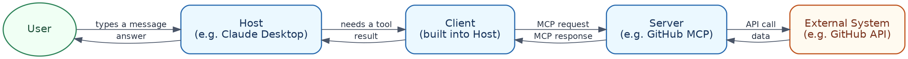
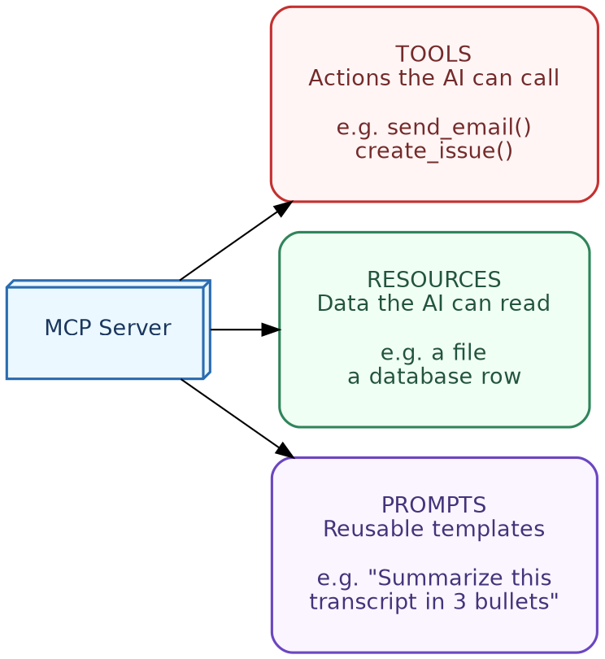
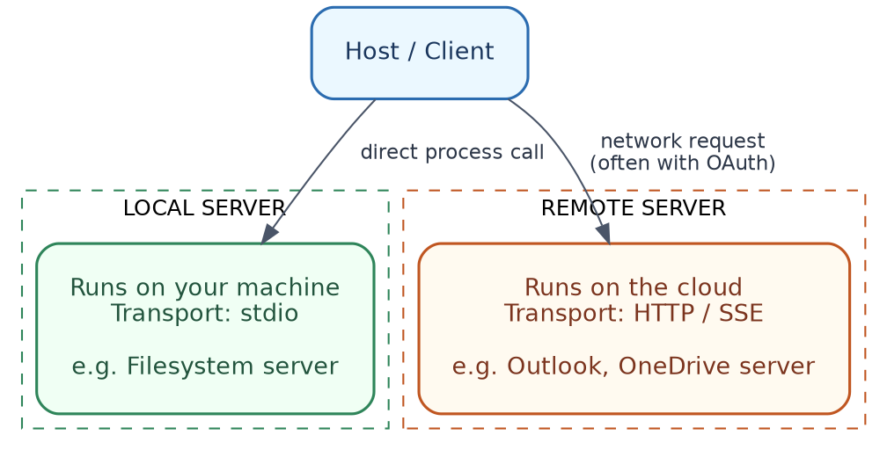
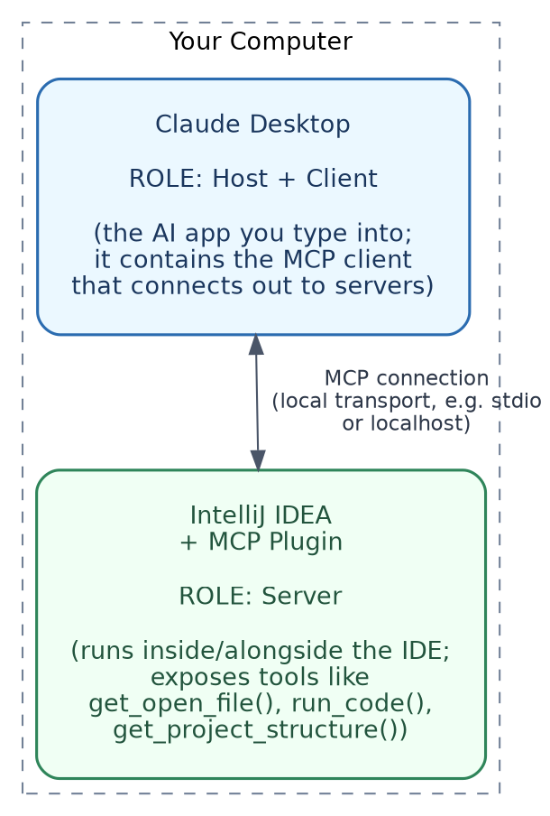
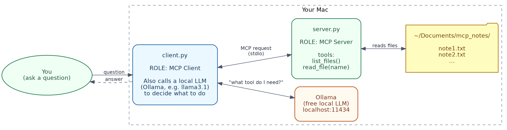

# The MCP Complete Handbook
### A Beginner-to-Medium Guide to the Model Context Protocol, in Simple Indian English

---

## Table of Contents

1. What is MCP? (Simple Analogy)
2. Why MCP Was Created
3. Core Building Blocks
4. Client vs Server
5. What Servers Provide
6. How Communication Works
7. MCP Across Different Apps (Claude Desktop, ChatGPT, Cursor, IntelliJ)
8. Your Setup: Claude Desktop + IntelliJ MCP Plugin
9. Popular MCP Servers (GitHub, Filesystem, Postgres, Outlook, OneDrive)
10. Setting Up Your First Server
11. Basic Security Concepts
12. Troubleshooting & Tools
13. Hands-On Lab: Build a Simple MCP Client + Server (Mac, Python, Free LLM)
14. Where to Go Next

---

## 1. What is MCP? (Simple Analogy)

**MCP (Model Context Protocol)** is an open standard that lets AI applications (like Claude, ChatGPT, or a code editor) connect to external tools, files, and data sources, all in one consistent way.

**Simple analogy: USB-C for AI apps.**

Before USB-C came along, every device had its own charger and cable. Once USB-C became the standard, any device could plug into any charger. MCP is doing basically the same thing, but for AI:

- Without MCP: every AI app needs its own custom code, just to talk to Slack, GitHub, a database, and so on.
- With MCP: one "MCP server" built for GitHub can be plugged into Claude, ChatGPT, Cursor, or any other MCP-compatible app — no rewriting needed, for any of them.

**One-line definition:**
> MCP is a standard protocol, that lets an AI model ask an external program for tools, data, or prompt templates, using one shared set of rules that everyone agrees on.

**Everyday example:**
Imagine you ask Claude, "What's the weather in Tokyo?" Claude does not know real-time weather, on its own. But if Claude is connected to a Weather MCP server, it can:
1. Recognise that it needs live data.
2. Call the weather server's `get_weather` tool.
3. Get the result back, and answer you properly.

### In terms of tools you already know

You have probably already noticed this exact pattern, without knowing the name for it. When **Claude Desktop** or **ChatGPT** searches the web to answer a question about today's news, it is doing the same basic thing — reaching out to an outside tool to get fresh information. **Cursor** does this constantly too, reaching into your actual codebase to read files, instead of guessing. MCP is simply the standard way of building that "reaching out" connection, so it works the same way across all these different apps.

---

## 2. Why MCP Was Created

**The problem: the "N×M problem."**

Imagine there are:
- N = AI applications (Claude, ChatGPT, Cursor, IntelliJ, custom agents, and so on)
- M = tools/data sources (GitHub, Slack, databases, file systems, email, and so on)

Without a shared standard, you would need a custom integration for every single AI app × every single tool combination. That is N × M separate integrations — quite expensive, and hard to maintain over time.

**The solution: a shared protocol.**

If every tool provider builds just ONE MCP server, and every AI app builds just ONE MCP client, then any app can use any tool. The math becomes N + M, instead of N × M.

**Example:**
- GitHub builds one MCP server for its API.
- Claude Desktop, Cursor, and IntelliJ each build MCP client support, only once.
- Now all three apps can use GitHub — without GitHub having to build three separate integrations, and without each app having to write custom GitHub code.

**Other goals of MCP:**
- Being an open standard (not tied to any single company)
- Having security and consent built in (user approves what each tool is allowed to do)
- Working both locally (on your own machine) and remotely (over the internet)
- Being simple enough that both small hobby tools, and large enterprise systems, can use it comfortably

### In terms of tools you already know

Before something like MCP existed, if you wanted **ChatGPT**, **Claude**, and **Cursor** to each connect to your company's GitHub, someone would have had to build three completely separate integrations, one for each app. MCP is exactly what avoids that duplicated effort — build the GitHub connection once, and every MCP-compatible app (Claude, Cursor, and others) can simply use it.

---

## 3. Core Building Blocks

MCP has three main roles:

| Role | What it is | Example |
|---|---|---|
| **Host** | The AI application the user interacts with | Claude Desktop, ChatGPT, Cursor |
| **Client** | The connector inside the host that talks to a server | Built into the host app |
| **Server** | The program that exposes tools, data, or prompts | A GitHub MCP server, a filesystem MCP server |

**Simple flow diagram:**



**Example in plain terms:**
You ask Claude Desktop: "List my open GitHub issues."
- Host = Claude Desktop app
- Client = the MCP connector, built inside Claude Desktop
- Server = the GitHub MCP server, which actually calls GitHub's API on your behalf

### In terms of tools you already know

- In **Claude Desktop**, Claude itself is the Host, with an MCP Client quietly built in.
- In **Cursor**, Cursor is the Host, and it also has an MCP Client built in, which is exactly what lets you connect it to tools like GitHub or a database.
- **ChatGPT** plays a similar Host role too, though (as covered in Section 7) its own connector system does not always use the MCP standard directly, even if the underlying idea is very similar.

---

## 4. Client vs Server

**What the Client does:**
- Lives inside the host application
- Discovers what tools/resources a server offers ("capability discovery")
- Sends requests to the server ("call this tool with these arguments")
- Receives results back, and passes them on to the AI model
- Manages the connection (open, close, reconnect)

**What the Server does:**
- Defines and exposes **tools** (actions), **resources** (data), and **prompts** (templates)
- Validates incoming requests
- Executes the actual logic (for example, querying a database, or reading a file)
- Returns structured results back to the client

**Who owns trust and permissions:**
- The **host** usually asks the **user** for permission, before a tool actually runs (for example, "Allow Claude to read this file?")
- The **server** should only do what it is scoped to do (for example, a "read-only" filesystem server should never be able to delete files)
- The **client** should never blindly trust server output — it should be treated like untrusted external data

**Simple example:**
- Client: "Do you have a tool called `search_issues`?"
- Server: "Yes, here is its schema — it takes a `query` string, and returns a list of issues."
- Client: "Please run `search_issues`, with query = 'bug'."
- Server: runs the search, returns 5 matching issues.
- Client: hands those 5 issues over to the AI model, to summarise for the user.

### In terms of tools you already know

When you use **Cursor**, and it asks "Allow Cursor to run this terminal command?" before actually running something — that permission step is exactly the "host asks the user for permission" idea described above. The client, inside Cursor, is the part quietly managing this whole back-and-forth with whichever MCP server you have connected.

---

## 5. What Servers Provide

MCP servers can expose three types of things:

### Tools
Actions the AI model can actively call, like functions.
**Example:** `send_email(to, subject, body)`, `create_github_issue(title, description)`

### Resources
Read-only data the model or user can access, like files or documents.
**Example:** A resource could be `file:///project/README.md`, or a URI like `github://repo/issues/42`

### Prompts
Reusable prompt templates the server provides, so users/apps do not need to write them from scratch, each time.
**Example:** A "code review" prompt template, that formats a diff and asks specific review questions.

**Quick comparison table:**

| Type | Purpose | Example |
|---|---|---|
| Tool | Perform an action | `create_calendar_event()` |
| Resource | Provide data | A PDF, log file, or database row |
| Prompt | Reusable instructions | "Summarize this meeting transcript in 3 bullet points" |



### In terms of tools you already know

When **Cursor** reads a file from your project to answer a question, that is a **resource** being used. When it actually edits a file, or runs a terminal command, that is a **tool** being called. Some MCP servers built for **Claude** also expose ready-made **prompts**, so you do not have to type out a long instruction yourself every time — you just pick the prompt template, and fill in the blanks.

---

## 6. How Communication Works

**JSON-RPC basics.**
MCP messages use JSON-RPC 2.0 — a simple format for sending requests, and getting back responses.

Example request (simplified):
```json
{
  "jsonrpc": "2.0",
  "id": 1,
  "method": "tools/call",
  "params": {
    "name": "get_weather",
    "arguments": { "city": "Tokyo" }
  }
}
```

Example response:
```json
{
  "jsonrpc": "2.0",
  "id": 1,
  "result": {
    "temperature": "24°C",
    "condition": "Cloudy"
  }
}
```

**Local vs remote servers:**

| Type | Transport | Example use |
|---|---|---|
| Local | stdio (standard input/output) | A filesystem server running on your own machine |
| Remote | HTTP / Server-Sent Events (SSE) | A cloud-hosted Slack or GitHub MCP server |



**Simple walkthrough:**
1. Host starts the server (locally), or connects to it (remotely).
2. Client and server "handshake" — they exchange details about what capabilities each one supports.
3. Client asks: "What tools do you have?"
4. Server replies with a list of tools, along with their input/output schemas.
5. When needed, the client calls a tool; the server executes it, and returns a result back.

### In terms of tools you already know

Every time **Claude Desktop** or **Cursor** shows you a small "using tool..." indicator while it works, that JSON-RPC exchange described above is happening right there, quietly, behind that little indicator on your screen.

---

## 7. MCP Across Different Apps (Claude Desktop, ChatGPT, Cursor, IntelliJ)

Several apps you already use support MCP, or something very close to it. Here is a single comparison, instead of a separate section for each.

| App | Does it use MCP directly? | How servers get connected | Typical first use |
|---|---|---|---|
| **Claude Desktop** | Yes, natively | A config file (`claude_desktop_config.json`), listing servers and how to launch them | Filesystem access, local note apps |
| **Cursor** | Yes, natively | Similar JSON config, added through Cursor's settings | GitHub, a database, documentation search |
| **IntelliJ (JetBrains IDEs)** | Yes, through a dedicated plugin | Plugin settings panel, or a config file | Reading GitHub issues, project context, right inside the IDE |
| **ChatGPT** | Partially — mainly through its own "Connectors" and "Actions" framework, with MCP-compatible support expanding over time | ChatGPT's own connector settings, or enterprise-specific setup | Internal company tools, wikis, ticketing systems |

**One config example, to see the shape of it (Claude Desktop and Cursor use nearly the same style):**
```json
{
  "mcpServers": {
    "filesystem": {
      "command": "npx",
      "args": ["-y", "@modelcontextprotocol/server-filesystem", "/Users/you/Documents"]
    }
  }
}
```
After adding this and restarting the app, it launches the server locally, does a capability handshake, and the tools become available in your chat, with a permission prompt shown before anything actually runs.

**Quick notes on the other three:**
- **Cursor:** same config style as above, just added through Cursor's own settings — commonly used to connect a database or GitHub, so the AI can check real schema or issues before writing code.
- **IntelliJ:** the plugin exposes your IDE's own context (open files, project structure) as MCP tools, so the assistant can answer questions grounded in your actual project, without switching windows.
- **ChatGPT:** uses its own Actions/Connectors system, which overlaps with MCP in spirit (structured tool calls, a permission step) but is not always literally MCP — mainly used for enterprise-internal tools today. Since this evolves quickly, check current documentation before relying on it for anything in production.

### In terms of tools you already know

If you already use **Cursor** for coding, you have most likely used MCP already, even without realising it — every time Cursor reads your codebase, searches for a symbol, or runs your tests through its agent mode, some of that is either built-in tooling, or an MCP server, working quietly in the background.

---

## 8. Your Setup: Claude Desktop + IntelliJ MCP Plugin

Since you are running **Claude Desktop, connected to IntelliJ via the MCP plugin**, here is exactly what each component is, and where it actually runs, in plain terms.

**The key idea:** in this setup, Claude Desktop and IntelliJ are BOTH running on your own computer — nothing goes out to a remote server, for this particular connection. They simply talk to each other locally.

| Component | Role in MCP terms | Where it runs | What it does |
|---|---|---|---|
| **Claude Desktop** | **Host + Client** | On your computer, as its own app | This is what you actually type into. It contains the MCP client, the part that reaches out and connects to servers. |
| **IntelliJ IDEA + MCP Plugin** | **Server** | On your computer, inside/alongside the IDE | The plugin turns your IDE into an MCP server. It exposes tools such as reading the currently open file, browsing your project structure, or running code — which Claude can then call. |
| **You (the developer)** | **User** | In front of your screen | You ask Claude a question; you also approve any permission prompts, before a tool actually runs. |

**Why it is set up this way:**
IntelliJ already knows everything about your project — open files, project structure, run configurations, and the code index. Instead of Claude Desktop trying to read your disk directly, and guessing which project you mean, the IntelliJ plugin exposes all that IDE context *as MCP tools*, so Claude can ask for exactly what it needs (for example, "what's in the currently open file?"), through a well-defined interface.

**Step-by-step walkthrough of what happens, when you ask Claude something, in this setup:**
1. You type a question in Claude Desktop, for example, "What does the `UserService` class in my open project do?"
2. Claude Desktop (**Host**) realises it needs IDE context, and its built-in **Client** sends a request over the MCP connection.
3. The **IntelliJ MCP plugin (Server)** receives the request, looks at the actual project open in your IDE, and runs the matching tool (for example, `get_file_contents`, or similar).
4. The plugin sends the result back, to Claude Desktop's client.
5. Claude Desktop's AI model reads that result, and writes you an answer, grounded in your real code — not just a guess.

**Where things physically live:**
- Both processes run locally, on your own machine.
- The connection between them is a **local transport** (similar to the stdio/local-socket pattern described in Section 6 — not over the public internet).
- No cloud server is involved, unless you have also separately connected a remote MCP server (like Outlook or OneDrive).



**Quick way to verify this yourself:**
- In IntelliJ, check the plugin's settings/status panel — it should usually show "MCP server running," along with a port or connection status.
- In Claude Desktop, check Settings → Developer/MCP section — it should list IntelliJ (or the plugin's server name) as a connected server, along with the tools it exposes.
- If you ask Claude something IDE-specific, and it responds with accurate details about your actual open project, that confirms the client-server connection is working properly.

---

## 9. Popular MCP Servers (GitHub, Filesystem, Postgres, Outlook, OneDrive)

Instead of going through each server type one by one, here is a single comparison table — since they all follow the same basic pattern (a set of tools, scoped to one system).

| Server | Common tools | Example question | Key safety note |
|---|---|---|---|
| **GitHub** | `search_issues()`, `create_issue()`, `list_pull_requests()`, `get_file_contents()` | "Create an issue in my `web-app` repo titled 'Fix login bug'" | Scope to specific repos where possible |
| **Filesystem** | `read_file()`, `write_file()`, `list_directory()`, `search_files()` | "Summarize all the meeting notes in my `Notes/2026` folder" | Always configure a specific root folder, so the AI can't read or modify files outside that scope |
| **PostgreSQL** | `list_tables()`, `describe_table()`, `run_query()` | "How many orders were placed last month?" | Keep it read-only by default; block `INSERT`, `UPDATE`, `DELETE` |
| **Outlook** | `list_emails()`, `send_email()`, `create_calendar_event()`, `search_emails()` | "Find the email from my manager about the Q3 budget" | Requires OAuth; ask for explicit confirmation before sending any email |
| **OneDrive** | `list_files()`, `read_file()`, `search_files()`, `upload_file()` | "Find my latest project proposal and pull out the budget section" | Same care as Filesystem, just for cloud storage instead of local disk |

Same basic pattern across all five: the AI calls the matching tool with the right arguments (for example, `create_issue(repo="web-app", title="Fix login bug")`), the server does the real work through that system's own API, and the result comes back into your chat — instead of you switching over to GitHub, your file explorer, Outlook, or OneDrive yourself.

### In terms of tools you already know

If you have connected **Claude** or **Cursor** to your GitHub account before, or asked either of them to read a local file, you have already used two of these five servers directly. The Outlook and OneDrive ones follow the exact same idea, just applied to Microsoft's ecosystem instead.

---

## 10. Setting Up Your First Server

Here is a simplified example of building a minimal MCP server (conceptually, using the Python SDK).

**Step 1: Install the SDK**
```bash
pip install mcp
```

**Step 2: Write a simple tool**
```python
from mcp.server.fastmcp import FastMCP

mcp = FastMCP("Calculator Server")

@mcp.tool()
def add(a: int, b: int) -> int:
    """Add two numbers together."""
    return a + b

if __name__ == "__main__":
    mcp.run()
```

**Step 3: Run it locally**
```bash
python calculator_server.py
```

**Step 4: Connect it to a host**
Add it to your host's config (for example, Claude Desktop's `claude_desktop_config.json`):
```json
{
  "mcpServers": {
    "calculator": {
      "command": "python",
      "args": ["/path/to/calculator_server.py"]
    }
  }
}
```

**Step 5: Test it**
Restart the host app, then ask: "What's 42 plus 58?" The AI should call your `add` tool, and return 100.

---

## 11. Basic Security Concepts

**Why permissions matter:**
MCP servers can take real actions (send emails, delete files, run SQL queries). Without proper safeguards, one mistake, or one piece of malicious input, could cause real harm.

**Key practices:**
- **User approval before running tools** — hosts typically show a confirmation dialog, the first time (or every time) a tool gets used.
- **Scoping access** — give servers only the minimum access they actually need (for example, a single folder, or read-only database access).
- **Not trusting server output blindly** — treat data returned by a server as untrusted input, especially if it comes from external sources like the web or emails, since it could contain hidden instructions ("prompt injection").
- **Authentication** — remote servers (like Outlook or OneDrive) typically require proper OAuth login, not just shared passwords.

**Simple example of a risk:**
If a Filesystem MCP server has write access to your entire hard drive, instead of just one folder, an AI mistake (or a manipulated prompt) could end up overwriting important files. Scoping access to just one folder limits how much damage could ever happen.

### In terms of tools you already know

This is exactly why **Cursor** always shows you a diff, and asks for approval before applying a code change, instead of just editing your files silently. It is also why **Claude Desktop** asks permission before a connected tool runs — these are not extra, annoying steps; they are the actual security model of MCP, working as intended.

---

## 12. Troubleshooting & Tools

**MCP Inspector** is an official tool for testing and debugging MCP servers, without needing a full host app running.

**What you can do with it:**
- Connect to a server directly, and see its available tools, resources, and prompts.
- Manually send test requests, and see the raw responses.
- Check for schema errors, before connecting the server to a real host.

**Common errors and fixes:**

| Error | Likely Cause | Fix |
|---|---|---|
| Server won't start | Wrong command/path in config | Double-check the config file paths |
| "Tool not found" | Client cached an old capability list | Restart the host app |
| Permission denied | Server scope too narrow, or missing OAuth | Check the server config, and re-authenticate |
| Timeout | Server hanging, or a slow external API call | Add logging to the server, to find where it is getting stuck |
| JSON parse error | Malformed response from the server | Validate that your server's JSON output matches the expected schema |

---

## 13. Hands-On Lab: Build a Simple MCP Client + Server (Mac, Python, Free LLM)

This is a complete, working mini-project — a **server** that gives an AI read-only access to a folder of `.txt` files on your Mac, and a **client** that connects a **free, local LLM** (via [Ollama](https://ollama.com)) to that server. No API keys needed, no paid accounts.

### What you will build



- `server.py` — an MCP server exposing two tools: `list_files()` and `read_file(filename)`, scoped to just one folder.
- `client.py` — an MCP client that launches the server, asks a local LLM a question, lets the LLM call tools if it needs to, and then prints the answer.
- **Ollama**, running a free open-source model (for example, `llama3.1`), entirely on your own machine.

### Step 1 — Install prerequisites

```bash
# Python MCP SDK + HTTP library
pip install mcp requests

# Ollama (free, local LLM runner)
brew install ollama
ollama pull llama3.1        # any tool-calling-capable model works
```

Ollama runs a local server at `http://localhost:11434` — that is the "free LLM" this lab actually uses. No internet call needed, no API key, no cost involved.

### Step 2 — Create a folder of notes

```bash
mkdir -p ~/Documents/mcp_notes
echo "Grocery list: eggs, milk, spinach, coffee." > ~/Documents/mcp_notes/note1.txt
echo "Project idea: build a home budget tracker in Python." > ~/Documents/mcp_notes/note2.txt
```

This is the folder your MCP server will be scoped to — the AI can only see files sitting inside here, nothing else on your Mac.

### Step 3 — The MCP Server (`server.py`)

```python
"""
server.py — a tiny MCP server that gives read-only access
to a folder of .txt files on your Mac.
"""

import os
from pathlib import Path
from mcp.server.fastmcp import FastMCP

# CHANGE THIS to whatever folder you want the AI to read from.
ALLOWED_DIR = Path(os.path.expanduser("~/Documents/mcp_notes")).resolve()
ALLOWED_DIR.mkdir(parents=True, exist_ok=True)

mcp = FastMCP("Notes Folder Server")


@mcp.tool()
def list_files() -> list[str]:
    """List all .txt files available in the notes folder."""
    return [f.name for f in ALLOWED_DIR.glob("*.txt")]


@mcp.tool()
def read_file(filename: str) -> str:
    """Read the full contents of one .txt file from the notes folder.

    Args:
        filename: the name of the file, e.g. 'note1.txt'
    """
    target = (ALLOWED_DIR / filename).resolve()

    # Safety check: never allow escaping the allowed folder.
    if not str(target).startswith(str(ALLOWED_DIR)):
        return "Error: access outside the notes folder is not allowed."
    if not target.exists():
        return f"Error: '{filename}' was not found in the notes folder."

    return target.read_text(encoding="utf-8", errors="ignore")


if __name__ == "__main__":
    mcp.run()
```

**Why the safety check matters:** without that `startswith` check, someone could ask for `filename="../../../etc/passwd"`, and read files way outside the notes folder. Always scope and validate paths properly, in any real server you build.

### Step 4 — The MCP Client (`client.py`)

```python
"""
client.py — a minimal MCP client that:
  1. Launches server.py and connects to it over MCP (stdio)
  2. Asks a free, local LLM (via Ollama) a question
  3. Lets the LLM call MCP tools (list_files / read_file) if it needs to
  4. Prints the final answer
"""

import asyncio
import requests

from mcp import ClientSession, StdioServerParameters
from mcp.client.stdio import stdio_client

OLLAMA_URL = "http://localhost:11434/api/chat"
MODEL = "llama3.1"


def mcp_tool_to_ollama_tool(tool) -> dict:
    """Convert an MCP tool definition into the JSON shape Ollama expects."""
    return {
        "type": "function",
        "function": {
            "name": tool.name,
            "description": tool.description or "",
            "parameters": tool.inputSchema,
        },
    }


async def main():
    question = input("Ask something about your notes folder: ")

    # 1. Launch the local MCP server as a subprocess and connect to it.
    server_params = StdioServerParameters(command="python3", args=["server.py"])

    async with stdio_client(server_params) as (read, write):
        async with ClientSession(read, write) as session:
            await session.initialize()

            # 2. Discover what tools the server offers.
            tools_response = await session.list_tools()
            ollama_tools = [mcp_tool_to_ollama_tool(t) for t in tools_response.tools]

            messages = [
                {
                    "role": "system",
                    "content": (
                        "You can answer questions about text files using the "
                        "provided tools. Always call list_files first if you "
                        "are not sure which file to read."
                    ),
                },
                {"role": "user", "content": question},
            ]

            # 3. Ask the local LLM, giving it the MCP tools as options.
            response = requests.post(
                OLLAMA_URL,
                json={"model": MODEL, "messages": messages, "tools": ollama_tools, "stream": False},
                timeout=120,
            ).json()

            msg = response["message"]

            # 4. If the model wants to call a tool, run it via the MCP server.
            if msg.get("tool_calls"):
                messages.append(msg)

                for call in msg["tool_calls"]:
                    tool_name = call["function"]["name"]
                    tool_args = call["function"]["arguments"]

                    print(f"  -> calling MCP tool: {tool_name}({tool_args})")
                    result = await session.call_tool(tool_name, tool_args)
                    tool_text = result.content[0].text

                    messages.append({"role": "tool", "content": tool_text})

                # 5. Send the tool result(s) back so the model can write a final answer.
                final = requests.post(
                    OLLAMA_URL,
                    json={"model": MODEL, "messages": messages, "stream": False},
                    timeout=120,
                ).json()
                print("\n" + final["message"]["content"])
            else:
                # Model answered directly without needing a tool.
                print("\n" + msg["content"])


if __name__ == "__main__":
    asyncio.run(main())
```

### Step 5 — Run it

```bash
python3 client.py
```

Try asking:
- `"What files do I have?"` → model calls `list_files()`
- `"What's on my grocery list?"` → model calls `list_files()`, figures out which file, then calls `read_file("note1.txt")`

### What's happening under the hood (mapped to earlier sections)

| Piece | MCP role | Section to review |
|---|---|---|
| `client.py` | Client (and also the Host, since there is no separate app wrapping it here) | Section 3-4 |
| `server.py` | Server | Section 3-5 |
| `list_files`, `read_file` | Tools | Section 5 |
| stdio connection between client and server | Local transport | Section 6 |
| the `startswith` check in `read_file` | Scoping / security | Section 11 |
| Ollama | The "brain" deciding when to call a tool — not part of MCP itself, just the LLM you plug in | — |

### Notes and troubleshooting

- If `ollama pull llama3.1` feels too large or slow, smaller tool-calling models (check Ollama's model library) work fine too — the code does not change, just the `MODEL` variable.
- If tool calls are not triggering, confirm your chosen model actually supports tool/function calling — not all local models do.
- This lab intentionally keeps the orchestration manual (no agent framework), so you can see every MCP request and response directly. Add `print(response)` after any API call, to inspect the raw JSON yourself.
- Exact Ollama and MCP SDK APIs keep evolving — if a call ever errors out, check the current docs for `ollama` (`ollama.com`), and the `mcp` Python package, for any signature changes.
- This exact pattern — a local client, deciding to call tools, and combining results into an answer — is the same underlying idea behind how **Claude Desktop** and **Cursor** work with MCP servers you connect, just wrapped in a proper app, instead of a small script.

---

## 14. Where to Go Next

**Official resources:**
- MCP official documentation and specification
- SDKs for Python, TypeScript, and other languages
- Official example servers (filesystem, GitHub, Postgres, and so on), as reference implementations

**Suggested learning path:**
1. Install Claude Desktop or Cursor, and connect an existing MCP server (like Filesystem or GitHub).
2. Use MCP Inspector, to explore how a server's tools are structured.
3. Build your own minimal server (like the calculator example above).
4. Add a real-world tool — for example, a weather API, a to-do list, or a simple database query tool.
5. Explore security scoping and OAuth, once you are comfortable with the basics.

**Small project ideas to practice:**
- A "notes" MCP server, that reads/writes a local markdown notes folder.
- A "task tracker" MCP server, backed by a simple SQLite database.
- A "weather" MCP server, that wraps a public weather API.

**One last note:** if you already use ChatGPT, Claude, and Cursor day to day, you are already a regular user of MCP-style patterns, whether you realised it or not. This handbook is really just pulling back the curtain, on what was already happening quietly, every time one of those tools reached outside itself to get you an answer.

---

*End of Handbook*
