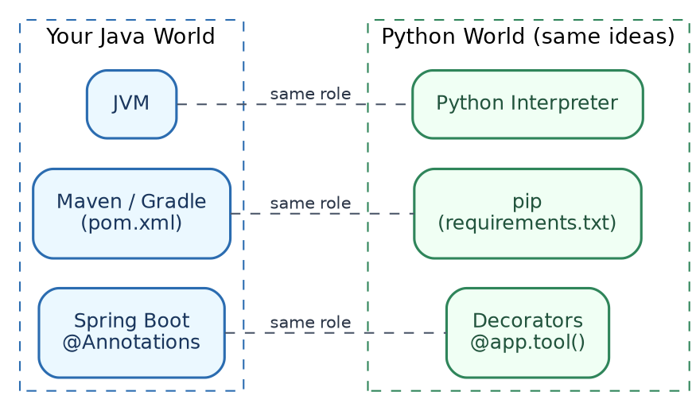
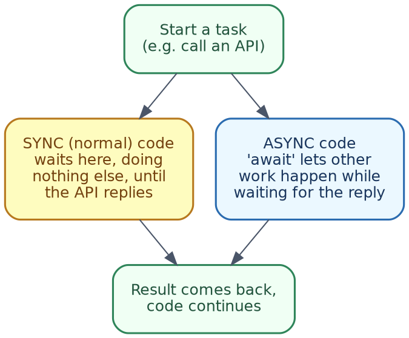

# Python for Java Developers Handbook
### A Simple Guide to Python, Written for Someone Who Already Knows Java and Spring Boot

---

## Table of Contents

1. Welcome / Why Python for AI
2. Setting Up (Compared to Java Tooling)
3. Syntax Basics
4. Data Types & Structures
5. Control Flow
6. Functions
7. List Comprehensions
8. Object-Oriented Python
9. Modules, Packages, and Imports
10. Error Handling
11. Decorators
12. Working with JSON and APIs
13. Async/Await
14. Context Managers
15. Type Hints
16. Key Libraries for AI Work
17. Environment Variables & Config
18. Hands-On Lab
19. Where to Go Next

---

## 1. Welcome / Why Python for AI

You already know how to code — Java, Spring Boot, Maven, all of that. This handbook is not "learn programming from zero." It is "learn Python's specific way of writing things," using your existing Java knowledge as the map.

**Why almost all AI tooling is Python-first:**
- Nearly every AI library (the MCP SDK, Ollama's client tools, LangChain, PyTorch, and so on) is written in Python first, and sometimes only in Python.
- The AI research community mostly grew up using Python, so new tools, papers, and example code default to it.
- Python's simple syntax makes it fast to write a quick script that calls an API or tests an idea, which matters a lot in a fast-moving field.

**The good news:** you already understand the *concepts* — variables, functions, classes, loops, error handling, calling an API. This handbook is really just teaching you Python's *spelling* of ideas you already know.

---

## 2. Setting Up (Compared to Java Tooling)



| What it does | Java | Python |
|---|---|---|
| Runs your code | JVM | Python interpreter |
| Manages dependencies | Maven or Gradle (`pom.xml`) | `pip` (`requirements.txt`) |
| Isolates project dependencies | Automatic, per Maven project | A virtual environment (`venv`) — you must create this yourself |

**Installing Python:** Download from python.org, or use `brew install python` on a Mac. Check it worked:
```bash
python3 --version
```

**Virtual environments — the one habit to build immediately:**

In Java, Maven already keeps each project's dependencies separate. Python does **not** do this automatically — if you `pip install` something, it goes globally, unless you create a virtual environment first.

```bash
# Create a virtual environment (do this once per project)
python3 -m venv venv

# Activate it (do this every time you start working)
source venv/bin/activate

# Now pip install only affects this project
pip install requests
```

**Simple analogy:** a virtual environment is like having a separate `pom.xml` and local Maven repository, for every single project — except Python needs you to switch it on manually, by "activating" it.

---

## 3. Syntax Basics

**The biggest shock for a Java developer: no curly braces, no semicolons.** Indentation (spacing) *is* the block structure.

```python
# Java uses { } to show what's inside an if-block.
# Python uses indentation instead — the same 4 spaces every time.

age = 25
if age >= 18:
    print("You are an adult")
    print("This line is also inside the if-block")
print("This line is outside the if-block")
```

**Simple rules:**
- Use 4 spaces for each level of indentation (not tabs — pick one and be consistent).
- No semicolons at the end of lines.
- A colon (`:`) starts a new indented block — after `if`, `for`, `def`, `class`, and so on.

**Variables — no type declaration needed:**
```python
name = "Priya"       # Python figures out this is text (str)
age = 28              # this is a number (int)
salary = 75000.50     # this is a decimal number (float)
is_active = True      # this is a boolean
```
In Java you would write `String name = "Priya";`. In Python, you just assign a value, and Python figures out the type on its own. You *can* still declare the expected type (see Section 15), but it is optional, and not enforced the way Java enforces it.

**Comments:**
```python
# This is a single-line comment (like // in Java)

"""
This is a multi-line comment,
often used as documentation at the top of a function or file.
"""
```

---

## 4. Data Types & Structures

| Concept | Java | Python |
|---|---|---|
| Growable list | `ArrayList<String>` | `list` |
| Key-value pairs | `HashMap<String, String>` | `dict` |
| Fixed, unchangeable sequence | A record, or an unmodifiable list | `tuple` |
| Unique values only | `HashSet<String>` | `set` |

**List (like `ArrayList`):**
```python
fruits = ["apple", "banana", "mango"]
fruits.append("orange")
print(fruits[0])        # apple
print(len(fruits))      # 4
```

**Dictionary (like `HashMap`):**
```python
person = {"name": "Rahul", "role": "Developer"}
print(person["name"])                    # Rahul
print(person.get("department", "N/A"))   # N/A, since "department" doesn't exist
person["department"] = "Engineering"     # add a new key
```

**Tuple (fixed, cannot be changed after creation):**
```python
coordinates = (12.9716, 77.5946)  # latitude, longitude
```

**Set (only unique values, like `HashSet`):**
```python
skills = {"Java", "Python", "Java"}  # duplicates are automatically removed
print(skills)  # {"Java", "Python"}
```

**Strings and f-strings (Python's version of `String.format()`):**
```python
name = "Priya"
age = 28
message = f"{name} is {age} years old"   # f-string: put values directly inside {}
print(message)
```
The `f` before the quotes tells Python to look for `{}` placeholders and fill them in — quite similar to Java's text blocks with `String.format()`, just with less typing.

---

## 5. Control Flow

**If / elif / else (same idea as Java's if/else if/else):**
```python
score = 75

if score >= 90:
    print("Grade A")
elif score >= 75:
    print("Grade B")
else:
    print("Grade C")
```
Note: Python uses `elif`, not `else if`.

**For loop (very close to Java's enhanced for-loop):**
```python
names = ["Amit", "Sara", "Priya"]
for name in names:
    print(f"Hello, {name}")
```
This is basically identical to Java's `for (String name : names)`.

**While loop:**
```python
count = 0
while count < 3:
    print(f"Count is {count}")
    count += 1   # Python has no ++ operator, use += 1 instead
```

**A quick note:** Python has no `switch` statement in older versions, but newer Python (3.10+) has `match`, which works similarly:
```python
status_code = 404

match status_code:
    case 200:
        print("OK")
    case 404:
        print("Not Found")
    case _:
        print("Unknown status")
```

---

## 6. Functions

**Basic function (like a Java method, but no return type or class needed):**
```python
def greet(name, greeting="Hello"):
    return f"{greeting}, {name}!"

print(greet("Amit"))                       # Hello, Amit!
print(greet("Amit", greeting="Namaste"))   # Namaste, Amit!
```
Notice: `greeting="Hello"` gives a **default value** — Java needs method overloading to achieve the same thing; Python just lets a parameter have a default.

**`*args` and `**kwargs` — Python's version of varargs:**
```python
def show_all(*args, **kwargs):
    print("args:", args)        # a tuple of all extra positional values
    print("kwargs:", kwargs)    # a dict of all extra named values

show_all(1, 2, 3, name="Rahul", city="Pune")
# args: (1, 2, 3)
# kwargs: {'name': 'Rahul', 'city': 'Pune'}
```
`*args` is similar to Java's `String... args` varargs. `**kwargs` has no direct Java equivalent — it collects any named arguments you did not explicitly list, into a dictionary.

**Lambda functions (same concept as Java lambdas, different syntax):**
```python
square = lambda x: x * x
print(square(5))   # 25

# Often used with functions like sorted() or map()
numbers = [4, 1, 3, 2]
print(sorted(numbers, key=lambda x: -x))  # sort descending: [4, 3, 2, 1]
```

---

## 7. List Comprehensions

This is Python's own idiom, without a clean Java equivalent, except perhaps Java Streams.

```python
numbers = [1, 2, 3, 4, 5, 6]

# Get only the even numbers, squared
squares = [n * n for n in numbers if n % 2 == 0]
print(squares)   # [4, 16, 36]
```

**Reading it left to right:** "give me `n * n`, for every `n` in `numbers`, but only if `n % 2 == 0`."

**Compare to Java Streams (conceptually, not literally):**
```
numbers.stream().filter(n -> n % 2 == 0).map(n -> n * n).collect(...)
```
Same idea — filter, then transform — just written in one compact line, instead of a chain of method calls.

**Dictionary comprehension (same idea, for dictionaries):**
```python
names = ["amit", "priya", "sara"]
capitalized = {name: name.capitalize() for name in names}
print(capitalized)   # {'amit': 'Amit', 'priya': 'Priya', 'sara': 'Sara'}
```

---

## 8. Object-Oriented Python

**A simple class:**
```python
class Employee:
    def __init__(self, name, role):
        self.name = name
        self.role = role

    def describe(self):
        return f"{self.name} works as a {self.role}"

e = Employee("Sara", "Backend Developer")
print(e.describe())   # Sara works as a Backend Developer
```

| Concept | Java | Python |
|---|---|---|
| Constructor | A method named after the class | `__init__(self, ...)` |
| Referring to the current object | `this` | `self` (must be the first parameter of every method, written explicitly) |
| Access modifiers | `private`, `public`, `protected` | No real enforcement — a single underscore prefix (`_name`) is just a *convention* meaning "please don't touch this from outside" |
| Interfaces | `interface` keyword, strict contract | Python uses **duck typing** — if an object has the right methods, it works, no formal interface required |

**Duck typing, explained simply:** "If it walks like a duck, and quacks like a duck, it's a duck." In Java, if you want a class to be used as a `PaymentProcessor`, it must formally `implement PaymentProcessor`. In Python, if your class simply has a method called `process_payment()`, it can be used anywhere a "payment processor" is expected — no formal interface declaration needed at all.

**Inheritance (simpler than Java's approach):**
```python
class Animal:
    def speak(self):
        return "Some sound"

class Dog(Animal):
    def speak(self):
        return "Woof"

d = Dog()
print(d.speak())   # Woof
```

---

## 9. Modules, Packages, and Imports

**A "module" in Python is just a `.py` file. A "package" is a folder of modules.**

```python
# math_utils.py
def add(a, b):
    return a + b
```

```python
# main.py
import math_utils

print(math_utils.add(3, 4))   # 7

# Or import just the function you need:
from math_utils import add
print(add(3, 4))   # 7
```

This is roughly similar to Java's `import` plus package structure, just with far less ceremony — no folder-matches-package-name rule enforced, and no `package` declaration needed at the top of the file.

**The famous `if __name__ == "__main__":` line — every Java developer's first question about Python:**
```python
def main():
    print("Running as the main program")

if __name__ == "__main__":
    main()
```
**What this actually means:** every Python file has a hidden variable called `__name__`. If you *run* this file directly (`python3 main.py`), `__name__` equals `"__main__"`, so the code inside runs. But if this same file is *imported* by another file instead, `__name__` will not equal `"__main__"`, so this block gets skipped. It is Python's way of saying, "only run this part if this file is the one being executed directly, not if it's just being imported for its functions." There is no single clean Java equivalent — it is closest in spirit to having a `main()` method only run when the class itself is the entry point, not when it's merely referenced by another class.

---

## 10. Error Handling

```python
try:
    result = 10 / 0
except ZeroDivisionError as ex:
    print(f"Caught error: {ex}")
finally:
    print("This always runs")
```

| Concept | Java | Python |
|---|---|---|
| Try a risky operation | `try` | `try` |
| Catch a specific error | `catch (SomeException e)` | `except SomeError as e:` |
| Always runs, error or not | `finally` | `finally` |
| Throw/raise an error | `throw new SomeException(...)` | `raise SomeError(...)` |
| Checked exceptions | Enforced by the compiler | Does not exist — Python does not force you to declare or catch anything |

**Raising your own error:**
```python
def withdraw(balance, amount):
    if amount > balance:
        raise ValueError("Insufficient balance")
    return balance - amount
```

**Catching multiple error types:**
```python
try:
    value = int("not a number")
except (ValueError, TypeError) as ex:
    print(f"Something went wrong: {ex}")
```

---

## 11. Decorators

This is the single most important Python concept for AI hands-on work, because almost every AI library uses it heavily (`@mcp.tool()`, `@app.route()`, `@agent.tool` — you will see this pattern constantly).

**The closest Java concept you already know: annotations** (`@RestController`, `@Autowired`, `@GetMapping`). A decorator is like an annotation that actually *wraps* your function with extra behaviour, rather than just being metadata read by a framework.

**A simple decorator, built from scratch, to see how it works:**
```python
def log_call(func):
    def wrapper(*args, **kwargs):
        print(f"Calling {func.__name__} with {args}")
        return func(*args, **kwargs)
    return wrapper

@log_call
def add(a, b):
    return a + b

print(add(3, 4))
# Calling add with (3, 4)
# 7
```

**What actually happened:** `@log_call` above `def add(...)` means "pass the `add` function into `log_call`, and use whatever it returns instead." The `wrapper` function runs first (printing the log line), then calls the real `add` function, then returns its result. This is exactly how something like `@mcp.tool()` works in the MCP Handbook's lab — it takes your plain function, and wraps it with extra behaviour (like registering it as a callable tool), without you needing to change the function's own code at all.

**Why this matters for your AI hands-on work:** when you see code like this in the MCP or Agentic AI handbooks —
```python
@mcp.tool()
def get_weather(city: str) -> str:
    ...
```
— read `@mcp.tool()` the same way you would read `@RestController` or `@GetMapping` in Spring Boot: "this plain function is being registered as something the framework can call, using extra behaviour bolted on around it."

---

## 12. Working with JSON and APIs

**The `requests` library is Python's equivalent of Java's `RestTemplate` or `WebClient`.**

```python
import requests

response = requests.get("https://api.example.com/users/1")
data = response.json()   # parses the JSON response into a Python dict
print(data["name"])
```

**Sending data (like a POST request):**
```python
import requests

response = requests.post(
    "https://api.example.com/users",
    json={"name": "Priya", "role": "Engineer"},
)
print(response.status_code)
print(response.json())
```

**Working with JSON directly (Python's equivalent of Jackson/Gson):**
```python
import json

data = {"name": "Priya", "skills": ["Java", "Spring Boot"]}

json_string = json.dumps(data)     # Python dict -> JSON text
print(json_string)

parsed = json.loads(json_string)   # JSON text -> Python dict
print(parsed["skills"])
```
`json.dumps()` (dump string) converts a Python object into JSON text. `json.loads()` (load string) does the reverse. This is exactly what you have seen throughout the other handbooks, whenever a script talks to Ollama's API or an MCP server.

---

## 13. Async/Await

This shows up constantly in the MCP and Agentic AI hands-on labs, so it is worth understanding properly, even briefly.



**The problem async solves:** normally, when your code calls something slow (like an API, or a database), it just sits there waiting, doing nothing else, until the response comes back. `async`/`await` lets other work happen while waiting, instead of just blocking.

**Closest Java comparison:** `CompletableFuture`, or the reactive style used in Project Reactor/WebFlux — the same underlying idea (do not block while waiting), expressed with very different syntax.

```python
import asyncio

async def fetch_data(name, delay):
    print(f"Starting {name}")
    await asyncio.sleep(delay)   # simulates waiting for an API call
    print(f"Finished {name}")
    return f"{name} result"

async def main():
    results = await asyncio.gather(
        fetch_data("Task A", 1),
        fetch_data("Task B", 1),
    )
    print(results)

asyncio.run(main())
```

**Reading this, piece by piece:**
- `async def` marks a function as one that *can* pause and wait, without blocking everything else.
- `await` is the actual pause point — "wait here for this to finish, but let other async work happen meanwhile."
- `asyncio.gather(...)` runs several async functions at the same time, rather than one after another.
- `asyncio.run(main())` is what actually starts the whole async system running — you will see this exact line at the bottom of the MCP client script.

**Simple rule while reading AI hands-on code:** any function defined with `async def` must be called using `await`, from inside another `async def` function — you cannot just call it directly like a normal function.

---

## 14. Context Managers

**Python's `with` statement is the equivalent of Java's try-with-resources.**

```python
with open("notes.txt", "w") as f:
    f.write("Hello from Python")

# The file is automatically closed here, even if an error happened above.
```

Compare this to Java:
```
try (FileWriter f = new FileWriter("notes.txt")) {
    f.write("Hello from Java");
}
```
Same underlying goal — make sure a resource (a file, a network connection, a database session) gets properly closed, even if something goes wrong in between. In Python, `with` handles this automatically for anything that supports it (files, some database connections, and so on).

---

## 15. Type Hints

This is probably the most comfortable section for you, since it looks the closest to Java.

```python
def multiply(x: int, y: int) -> int:
    return x * y
```

`x: int` says "x is expected to be an int." `-> int` says "this function returns an int." **Important:** unlike Java, Python does **not** enforce this at runtime — it is a hint for readability and tooling (like autocomplete, or a checker like `mypy`), not a hard rule. You could still technically pass in a string, and Python would not stop you until something actually breaks.

```python
def greet(name: str) -> str:
    return f"Hello, {name}"

# Type hints are just documentation here — Python won't stop you from doing this:
greet(123)   # No error at this line, though it may behave oddly depending on the function
```

**Why bother with type hints then?** They make code much easier to read (especially for someone coming from Java), and most modern code editors will warn you if you pass the wrong type, even though Python itself will not stop you at runtime.

---

## 16. Key Libraries for AI Work

You will see these constantly across the other handbooks in this series.

| Library | What it's for | Java-world comparison |
|---|---|---|
| `requests` | Making HTTP calls to APIs (like Ollama, or any REST API) | `RestTemplate` / `WebClient` |
| `json` | Converting between Python objects and JSON text | Jackson / Gson |
| `numpy` | Fast math on arrays of numbers (used heavily in the RAG handbook, for embeddings) | No direct equivalent; closest is a specialised math library |
| `pathlib` | Working with file paths in a clean, object-oriented way | `java.nio.file.Path` |
| `asyncio` | Writing async, non-blocking code | `CompletableFuture` / reactive streams |

**A quick `pathlib` example, since it appears in the MCP hands-on lab:**
```python
from pathlib import Path

folder = Path("~/Documents/notes").expanduser()
folder.mkdir(parents=True, exist_ok=True)

for file in folder.glob("*.txt"):
    print(file.name)
```
`Path` objects let you build and navigate file paths without manually gluing strings together with slashes — similar in spirit to Java's `Path` and `Paths.get(...)`.

---

## 17. Environment Variables & Config

**Python's equivalent of `application.properties` / `application.yml` is usually a `.env` file, plus `os.environ`.**

```python
import os

api_key = os.environ.get("OPENAI_API_KEY", "no-key-set")
print(api_key)
```

Setting an environment variable, before running your script:
```bash
export OPENAI_API_KEY=sk-abc123
python3 my_script.py
```

For anything bigger than one or two variables, Python projects commonly use a `.env` file, plus a small library (`python-dotenv`) to load it automatically — conceptually similar to how Spring Boot auto-loads `application.properties` at startup, just needing one extra line of code to opt in.

---

## 18. Hands-On Lab

A small script that touches most of the concepts above, in one place — reading employee data (JSON), using type hints, a decorator, error handling, and a context manager, all together.

```python
"""
practice_lab.py — touches most of the Python concepts from this handbook,
using a small, familiar example: employee records.
"""

import json
from pathlib import Path


def log_call(func):
    """A simple decorator (Section 11), just to see it in action."""
    def wrapper(*args, **kwargs):
        print(f"[log] Calling {func.__name__}")
        return func(*args, **kwargs)
    return wrapper


class Employee:
    """A simple class (Section 8)."""
    def __init__(self, name: str, role: str):
        self.name = name
        self.role = role

    def describe(self) -> str:
        return f"{self.name} works as a {self.role}"


@log_call
def load_employees(path: str) -> list[dict]:
    """Type hints (Section 15) + context manager (Section 14) + error handling (Section 10)."""
    file_path = Path(path)

    if not file_path.exists():
        raise FileNotFoundError(f"No such file: {path}")

    with open(file_path, "r", encoding="utf-8") as f:
        return json.load(f)


def main():
    data_file = "employees.json"

    # Create some sample data first, so the lab runs standalone.
    sample_data = [
        {"name": "Priya Nair", "role": "Backend Engineer"},
        {"name": "Marcus Webb", "role": "Sales Manager"},
    ]
    with open(data_file, "w", encoding="utf-8") as f:
        json.dump(sample_data, f)

    try:
        records = load_employees(data_file)
    except FileNotFoundError as ex:
        print(f"Could not load data: {ex}")
        return

    # List comprehension (Section 7)
    employees = [Employee(r["name"], r["role"]) for r in records]

    # For loop (Section 5)
    for e in employees:
        print(e.describe())


if __name__ == "__main__":
    main()
```

Run it with:
```bash
python3 practice_lab.py
```

**What to notice while reading the output:**
- The `[log] Calling load_employees` line proves the decorator ran, wrapping the real function.
- No crash occurs, even though we check for a missing file first (error handling).
- The `with open(...)` block automatically handles closing the file for us (context manager).
- The final `describe()` calls show the class and list comprehension working together.

---

## 19. Where to Go Next

**Suggested next steps:**
1. Re-open the MCP Handbook's Hands-On Lab (Section 13 there), and re-read `server.py` and `client.py` — you should now recognise decorators, type hints, async/await, and JSON handling throughout it.
2. Do the same with the RAG Handbook's lab — look specifically for `numpy` usage, and the list comprehension patterns.
3. Try modifying the Hands-On Lab above — add a new field to the employee data, and a new method to the `Employee` class.
4. Once comfortable, revisit the Agentic AI Handbook's framework examples (Section 13 there) — you will now be able to read the CrewAI, LangGraph, and OpenAI Agents SDK code samples properly, instead of just copy-pasting them.

**A quick mental checklist, for reading any new Python AI code you come across:**
- Spot the decorators (`@something`) — read them like Spring annotations, marking a function as special to some framework.
- Spot `async def` and `await` — remember, these mean "this can wait for something, without blocking everything else."
- Spot `with` — a resource is being safely opened and closed.
- Spot type hints (`: int`, `-> str`) — treat them as helpful comments, not hard guarantees, the way Java's compiler would enforce them.

---

*End of Handbook*
