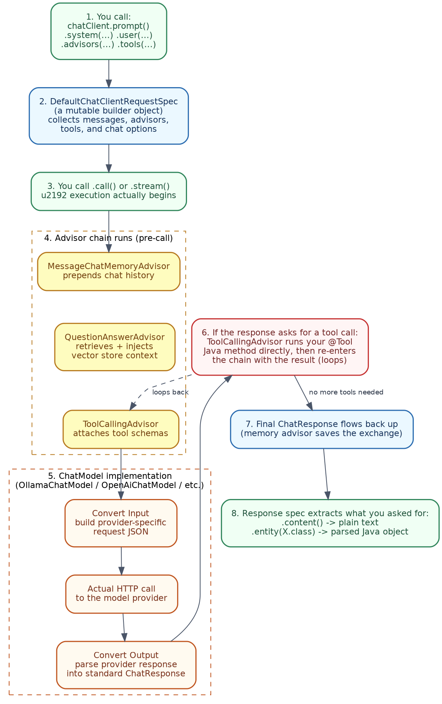
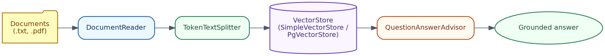
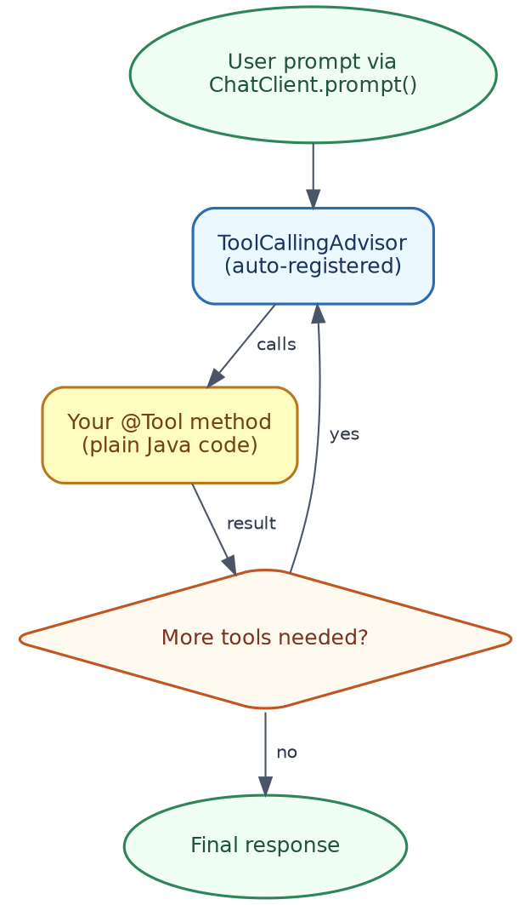

# Spring AI Handbook
### A Detailed Guide to Building GenAI, RAG, and Agentic AI Applications in Java, in Simple Indian English

---

## Table of Contents

1. What is Spring AI? (Quick Intro)
2. Setting Up a Spring AI Project
3. The ChatClient API (Core Abstraction)
4. Model Providers
5. Prompts and Prompt Templates
6. Structured Output
7. Hands-On Lab: GenAI Chat Endpoint
8. Function / Tool Calling
9. Advisors (Spring AI's Interceptor Pattern)
10. RAG in Spring AI
11. Vector Store Integrations
12. Hands-On Lab: RAG Over Your Own Documents
13. Chat Memory
14. MCP Support in Spring AI
15. Hands-On Lab: A Tool-Calling Agent
16. Multimodal — Image and Audio
17. Observability and Evaluation
18. Where to Go Next

---

## A quick honest note before we start

This handbook's Java code is written and checked carefully against Spring AI's current, verified documentation (Spring AI 2.0, generally available as of June 2026). But unlike the Python handbooks in this series, I could not actually compile or run this code in this environment — there is no Maven, and no internet access here to download the Spring AI libraries or talk to a live Ollama server. So please treat the code as accurate and ready to try, but do a normal build-and-run check on your own machine, the way you would with any new dependency, before relying on it for something important.

---

## 1. What is Spring AI? (Quick Intro)

**Spring AI is basically what LangChain is for Python, but built the Spring way, for Java.** If you have read the Generative AI, RAG, or Agentic AI handbooks in Python, every single concept in those maps directly onto something in Spring AI — just written as Spring beans, annotations, and fluent builders, instead of Python functions and decorators.

**Where it fits in an app you already know how to build:**
```
Your existing Spring Boot app
  @RestController  →  same as always
  @Service         →  same as always
  ChatClient       →  NEW — this is Spring AI's core abstraction for talking to an LLM
```

You are not learning a new framework from scratch. You are adding a new kind of bean (`ChatClient`) into a Spring Boot app you already know how to build, configure, and deploy.


### In terms of tools you already know

If you have used **ChatGPT** or **Claude** through their web apps, Spring AI is what lets you build your *own* version of that experience, inside a Spring Boot backend — the same conversational, tool-using behaviour, but running on your own server, with your own business logic wrapped around it. **Cursor**, when it suggests Spring AI code for you, is really just recommending the Spring-flavoured version of ideas you already understand from Python-based AI tools.

---

## 2. Setting Up a Spring AI Project

**Step 1 — Start from Spring Initializr, same as always.** Add the Spring AI BOM (Bill of Materials), so all Spring AI dependency versions stay consistent:

```xml
<dependencyManagement>
    <dependencies>
        <dependency>
            <groupId>org.springframework.ai</groupId>
            <artifactId>spring-ai-bom</artifactId>
            <version>2.0.0</version>
            <type>pom</type>
            <scope>import</scope>
        </dependency>
    </dependencies>
</dependencyManagement>
```

**Step 2 — Add a model starter.** For this handbook, we will mostly use **Ollama**, since it is free and runs locally — no API key needed, same as the Python labs in this series:

```xml
<dependency>
    <groupId>org.springframework.ai</groupId>
    <artifactId>spring-ai-starter-model-ollama</artifactId>
</dependency>
```

**Step 3 — Configure it, in `application.yml` (Spring AI's version of a `DataSource` config):**
```yaml
spring:
  ai:
    ollama:
      base-url: http://localhost:11434
      chat:
        options:
          model: llama3.1
```

### In terms of tools you already know

This `application.yml` block plays exactly the same role as your database connection settings do for a `DataSource` bean — you are just telling Spring where the "AI" lives, instead of where the database lives. Just like you can swap a MySQL `DataSource` for a Postgres one by changing config, you can swap Ollama for OpenAI or Claude, later in this handbook, the same way — through config, not code.

---

## 3. The ChatClient API (Core Abstraction)

`ChatClient` is Spring AI's main entry point — described in Spring's own docs as being "idiomatically similar to `WebClient` and `RestClient`," which you already know well.

**Your first "hello world" chat call:**
```java
@RestController
public class ChatController {

    private final ChatClient chatClient;

    public ChatController(ChatClient.Builder builder) {
        this.chatClient = builder.build();
    }

    @GetMapping("/joke")
    public String joke() {
        return chatClient.prompt("Tell me a short joke about Java developers")
                .call()
                .content();
    }
}
```

**Reading this, piece by piece:**
- `ChatClient.Builder` is auto-configured by Spring Boot, based on whichever model starter you added (Ollama, in Section 2) — you just ask for it in your constructor, exactly like you would ask for a `JdbcTemplate` or a `Repository`.
- `.prompt("...")` starts building a request.
- `.call()` actually sends it to the model.
- `.content()` pulls out just the plain text response.

That covers *using* `ChatClient`. Now let us go one level deeper, and look at what actually happens, step by step, from the moment you call `.prompt()` to the moment `.content()` returns a string.

### How ChatClient works internally, step by step



**Step 1 — `ChatClient.Builder` is created for you, at startup.**
When Spring Boot sees the Ollama starter (or OpenAI, or Anthropic) on the classpath, its auto-configuration creates a `ChatModel` bean (for example, `OllamaChatModel`), and wraps it in a prototype `ChatClient.Builder` bean. This is exactly why your constructor can simply ask for `ChatClient.Builder`, the same way it might ask for a `JdbcTemplate` — Spring has already wired the underlying connection for you, based on your `application.yml`.

**Step 2 — `.prompt()` creates a request-builder object, not a request itself.**
Calling `chatClient.prompt(...)` does not immediately talk to any model. Internally, Spring AI's default implementation (`DefaultChatClient`) creates an internal spec object (`DefaultChatClientRequestSpec`), which is just a mutable builder — it starts collecting everything you chain onto it: your system message, your user message, any advisors, any tools, any chat options. Nothing is sent anywhere yet.

**Step 3 — `.system(...)`, `.user(...)`, `.advisors(...)`, `.tools(...)` all just fill in that same spec object.**
Each of these fluent methods adds one more piece of information into the request spec being built — a system message here, a user message there, an advisor added to a list, a tool added to another list. This is exactly why the order you chain them in `chatClient.prompt().system(...).user(...)` reads naturally, left to right, like assembling a request — because that is literally what is happening, one field at a time, on one growing object.

**Step 4 — `.call()` (or `.stream()`) is the moment execution actually begins.**
Up to this point, everything was just building a request in memory. `.call()` is the trigger — it takes the fully assembled spec, and starts actually running it, through the advisor chain.

**Step 5 — the advisor chain runs first, before the model is ever contacted.**
Spring AI runs your registered advisors (Section 9) in order, each one getting a chance to modify the request before it goes any further:
- `MessageChatMemoryAdvisor` (if present) fetches prior conversation history, and prepends it to your messages.
- `QuestionAnswerAdvisor` (if present) runs a similarity search against your `VectorStore`, and inserts the retrieved chunks as extra context (this is the whole RAG pattern from Section 10, happening right here).
- `ToolCallingAdvisor` (auto-registered whenever you have `@Tool`-annotated beans) attaches the JSON schema for each available tool, so the model knows what it is allowed to call.

**Step 6 — the (now modified) request reaches the actual `ChatModel` implementation.**
This is where a specific class like `OllamaChatModel` or `OpenAiChatModel` takes over, and it follows a further three-step pattern of its own, confirmed directly in Spring AI's reference docs:
- **Convert Input:** your Spring AI `Prompt` object gets translated into whatever JSON shape that specific provider's API actually expects (Ollama's shape is different from OpenAI's, different again from Claude's).
- **The actual network call happens here** — an HTTP request goes out to `localhost:11434` (for Ollama), or to the provider's cloud API.
- **Convert Output:** the provider's raw JSON response gets translated back into Spring AI's own standard `ChatResponse` object — so your code never has to deal with each provider's different response shape directly.

**Step 7 — if the model's response asks for a tool call, the loop repeats.**
If `ChatResponse` indicates the model wants to call a tool, `ToolCallingAdvisor` steps in: it finds your matching `@Tool`-annotated Java method (using reflection, based on the tool name and JSON arguments the model provided), actually invokes it, and then re-enters the advisor chain with that tool's result added to the conversation — going back through Step 5 and Step 6 again. This repeats until the model responds with no further tool calls needed. This recursive behaviour is exactly what powers the Agentic AI lab in Section 15, without you writing a manual loop yourself.

**Step 8 — the final response flows back up, and gets saved if memory is enabled.**
Once there are no more tool calls to make, the final `ChatResponse` flows back up through the chain. If `MessageChatMemoryAdvisor` is present, this is also the point where the new exchange (your message, plus the model's reply) gets written back into the `ChatMemory` store, ready for the next request.

**Step 9 — the response spec extracts exactly what you asked for.**
Finally, whichever method you chained at the very end decides what you actually get back:
- `.content()` simply pulls out the plain text from the final `ChatResponse`.
- `.entity(SomeRecord.class)` does one extra thing, back at Step 3 — when you call `.entity(...)`, Spring AI had already quietly added formatting instructions into your prompt (via a `BeanOutputConverter`), asking the model to respond in a JSON shape matching your record. Now, at this final step, that same converter takes the model's text response, and parses it with Jackson (the same JSON library your REST controllers already use) directly into your Java object.

### Why this design matters, once you are building real applications

Notice that your own code, in the `joke()` method above, never mentions Ollama, HTTP, JSON conversion, or advisors at all — all nine of the steps above happen underneath one `.prompt().call().content()` chain. This is precisely why swapping Ollama for OpenAI or Claude later (Section 4) needs no code change: Steps 1 through 4, 5, 7, 8, and 9 are all provider-agnostic; only Step 6's `ChatModel` implementation actually changes.

### In terms of tools you already know

This internal flow maps almost exactly onto ideas you already use daily:
- **`ChatModel` implementations (`OllamaChatModel`, `OpenAiChatModel`, and so on) are just like JDBC drivers.** Your code talks to one interface (`ChatClient`/`ChatModel`), and a specific driver underneath handles the actual provider-specific "dialect" — same idea as how your JPA repository code stays identical, whether it is talking to MySQL or Postgres underneath.
- **The advisor chain is exactly a Servlet `Filter` chain, or a Spring MVC `Interceptor` chain.** Each advisor gets a "before" and "after" opportunity around the actual call, just like a logging or authentication filter wraps around your controller method — except here, what is being wrapped is a call to an LLM, not a call to your business logic.
- **The tool-calling loop repeating Steps 5-7 is conceptually similar to a retry-with-backoff loop you might write around a flaky downstream service** — except the "decision" to retry is made by the model itself, not by fixed retry logic you wrote.
- `ChatClient` reads almost exactly like `RestClient` or `WebClient` — `.prompt()` instead of `.get()`/`.post()`, `.call()` instead of `.retrieve()`, `.content()` instead of `.body()`. If you are comfortable calling a REST API with `RestClient`, you are already comfortable with the outer shell of `ChatClient` — this section just opened up what is running underneath that familiar shell.

---

## 4. Model Providers

**One of Spring AI's biggest strengths: swapping the underlying model is a config change, not a code change.**

| Provider | Starter dependency | Typical use |
|---|---|---|
| **Ollama** | `spring-ai-starter-model-ollama` | Free, local, great for development and these hands-on labs |
| **OpenAI** | `spring-ai-starter-model-openai` | ChatGPT's models, via API key |
| **Anthropic** | `spring-ai-starter-model-anthropic` | Claude's models, via API key |
| **Azure OpenAI** | `spring-ai-starter-model-azure-openai` | OpenAI's models, through Azure, with enterprise features |

**The same `ChatController` code from Section 3 works unchanged**, no matter which of these you pick — only the dependency and the `application.yml` block change. This handbook uses Ollama throughout the hands-on labs, so everything is runnable for free, but the exact same Java code would work with ChatGPT or Claude, just by swapping the starter and adding an API key.

### In terms of tools you already know

This is similar in spirit to how you might swap Hibernate's dialect between MySQL and Postgres — the application code barely changes; only the configuration describing *which* backend you are talking to changes.

---

## 5. Prompts and Prompt Templates

**System vs. user messages, in Spring AI's shape:**
```java
String response = chatClient.prompt()
        .system("You are a helpful assistant for a Spring Boot developer. Be concise.")
        .user("What annotation starts a Spring Boot application?")
        .call()
        .content();
```

**Prompt templates**, for reusable, parameterised prompts:
```java
String response = chatClient.prompt()
        .user(u -> u.text("Explain {topic} to a beginner, in exactly 3 sentences.")
                    .param("topic", "dependency injection"))
        .call()
        .content();
```
The `{topic}` placeholder gets filled in by `.param("topic", ...)` — this is Spring AI's version of the "prompt template" idea covered in the Prompt Engineering Handbook.

### In terms of tools you already know

`.system(...)` here plays exactly the same role as a **Claude Project's instructions**, or **ChatGPT's Custom Instructions** — it sets behaviour for the whole exchange, while `.user(...)` is the one-off, specific request each time.

---

## 6. Structured Output

Instead of getting back plain text and manually parsing it, Spring AI can convert the model's response directly into a Java record.

```java
public record ActorFilms(String actor, List<String> movies) {}

ActorFilms result = chatClient.prompt()
        .user("Generate a fictional actor and list 3 movies they starred in")
        .call()
        .entity(ActorFilms.class);

System.out.println(result.actor());
System.out.println(result.movies());
```

**What is happening behind the scenes:** Spring AI adds formatting instructions to your prompt automatically (telling the model to respond in a JSON shape matching `ActorFilms`), then parses that JSON straight into your record — using the same Jackson library your Spring Boot app already uses for its REST APIs.

### In terms of tools you already know

This is the Java equivalent of asking **ChatGPT** or **Claude** to "respond only in JSON, matching this schema," except Spring AI handles the prompt-wording and the parsing for you automatically, instead of you writing that instruction and the parsing code by hand.

---

## 7. Hands-On Lab: GenAI Chat Endpoint

A complete, small Spring Boot REST API, with a `/chat` endpoint, using free local Ollama, returning structured output.

**Prerequisites (same Ollama setup as the Python labs in this series):**
```bash
brew install ollama
ollama pull llama3.1
```

**`pom.xml` (relevant parts):**
```xml
<dependencyManagement>
    <dependencies>
        <dependency>
            <groupId>org.springframework.ai</groupId>
            <artifactId>spring-ai-bom</artifactId>
            <version>2.0.0</version>
            <type>pom</type>
            <scope>import</scope>
        </dependency>
    </dependencies>
</dependencyManagement>

<dependencies>
    <dependency>
        <groupId>org.springframework.boot</groupId>
        <artifactId>spring-boot-starter-web</artifactId>
    </dependency>
    <dependency>
        <groupId>org.springframework.ai</groupId>
        <artifactId>spring-ai-starter-model-ollama</artifactId>
    </dependency>
</dependencies>
```

**`application.yml`:**
```yaml
spring:
  ai:
    ollama:
      base-url: http://localhost:11434
      chat:
        options:
          model: llama3.1
```

**`ChatController.java`:**
```java
package com.example.springai;

import org.springframework.ai.chat.client.ChatClient;
import org.springframework.web.bind.annotation.*;

import java.util.List;

@RestController
public class ChatController {

    private final ChatClient chatClient;

    public ChatController(ChatClient.Builder builder) {
        this.chatClient = builder.build();
    }

    // Plain text chat, similar to the Python labs' generate() function
    @GetMapping("/chat")
    public String chat(@RequestParam String message) {
        return chatClient.prompt(message).call().content();
    }

    // Structured output — the model's answer comes back as a real Java object
    public record MovieSuggestion(String title, String reason) {}

    @GetMapping("/suggest-movie")
    public MovieSuggestion suggestMovie(@RequestParam String mood) {
        return chatClient.prompt()
                .user(u -> u.text("Suggest one movie for someone feeling {mood}, "
                                 + "and briefly explain why.")
                            .param("mood", mood))
                .call()
                .entity(MovieSuggestion.class);
    }
}
```

**Try it:**
```bash
mvn spring-boot:run

curl "http://localhost:8080/chat?message=Explain%20polymorphism%20in%20one%20sentence"
curl "http://localhost:8080/suggest-movie?mood=nostalgic"
```

### What's happening under the hood (mapped to earlier sections)

| Piece | Concept | Section |
|---|---|---|
| `ChatClient.Builder` autowired | Auto-configuration, based on the Ollama starter | Section 2, 3 |
| `.prompt(message).call().content()` | The basic chat call | Section 3 |
| `MovieSuggestion` record + `.entity(...)` | Structured output | Section 6 |
| `spring.ai.ollama.*` in `application.yml` | Swappable model provider config | Section 4 |

---

## 8. Function / Tool Calling

This is confirmed current in Spring AI 2.0: the `@Tool` annotation lets you turn any plain Java method into something the model can call, without writing any manual callback/schema code yourself.

```java
@Component
public class WeatherTools {

    @Tool(description = "Get the current weather for a given city")
    public String getWeather(@ToolParam(description = "The city name, e.g. Pune") String city) {
        // In a real app, this would call an actual weather API.
        return switch (city.toLowerCase()) {
            case "pune" -> "28°C, clear skies";
            case "mumbai" -> "31°C, humid";
            default -> "No data for " + city;
        };
    }
}
```

**Using the tool with `ChatClient`:**
```java
String response = chatClient.prompt("What's the weather like in Pune right now?")
        .tools(new WeatherTools())
        .call()
        .content();
```

**What actually happens:** Spring AI automatically generates a JSON schema describing your `getWeather` method, based on the method signature and the `@Tool`/`@ToolParam` descriptions. The model decides, on its own, whether it needs to call this tool, Spring AI runs your actual Java method when it does, and the result gets fed back to the model to write its final answer — the exact same think-act-observe loop covered in the Agentic AI Handbook, just happening inside `ChatClient` instead of a hand-written Python loop.

### In terms of tools you already know

Read `@Tool` exactly like you would read `@RestController` or `@GetMapping` in a normal Spring Boot app — it is Spring's declarative way of saying "this plain method is being registered as something the framework (in this case, the AI model) can call." It is also the exact Java equivalent of the `@mcp.tool()` decorator you saw in the Python-based MCP Handbook.

---

## 9. Advisors (Spring AI's Interceptor Pattern)

An `Advisor` in Spring AI plays a similar role to a Spring `Filter` or `Interceptor` — it wraps around a request, and can inspect or modify it, before and after the actual model call.

**Common built-in advisors:**

| Advisor | What it does |
|---|---|
| `MessageChatMemoryAdvisor` | Automatically adds conversation history to each request (Section 13) |
| `QuestionAnswerAdvisor` | Automatically retrieves relevant chunks from a `VectorStore`, and adds them as context — this is RAG, built in (Section 10) |
| `ToolCallingAdvisor` | Auto-registered by `ChatClient` in Spring AI 2.0; runs the full tool-call loop from Section 8 |

**Using an advisor:**
```java
String response = chatClient.prompt()
        .advisors(new QuestionAnswerAdvisor(vectorStore))
        .user("What's our refund policy?")
        .call()
        .content();
```

**A key detail from Spring AI 2.0:** advisors can sit either *outside* or *inside* the tool-calling loop — this ordering decides whether, for example, a memory advisor captures just the final answer, or the full back-and-forth tool conversation too. For most everyday use, the defaults Spring AI ships with are sensible, but it is worth knowing this ordering exists, once you start combining several advisors together.

### In terms of tools you already know

Think of advisors the same way you think of a logging `Filter` in a Spring MVC app — every request passes through the chain, each advisor gets a chance to add something (memory, retrieved documents, tool results) before the request finally reaches the model.

---

## 10. RAG in Spring AI

Spring AI calls document loading and preparation the **ETL Pipeline** (Extract, Transform, Load) — borrowing the term from data engineering, though it is really the same ingestion pipeline covered in the RAG Handbook.



**The three main pieces:**

| Piece | Role | Example class |
|---|---|---|
| `DocumentReader` | Loads raw content into Spring AI's `Document` objects | `PagePdfDocumentReader`, `TikaDocumentReader`, `TextReader` |
| `TextSplitter` | Breaks documents into smaller chunks | `TokenTextSplitter` |
| `VectorStore` | Embeds and stores chunks, and later retrieves the closest matches | `SimpleVectorStore`, `PgVectorStore`, and others (Section 11) |

**A simple ingestion example:**
```java
@Component
public class DataIngestion {

    private final VectorStore vectorStore;

    public DataIngestion(VectorStore vectorStore) {
        this.vectorStore = vectorStore;
    }

    @PostConstruct
    void loadDocuments() {
        TextReader reader = new TextReader(new ClassPathResource("policies.txt"));
        List<Document> documents = reader.get();

        TokenTextSplitter splitter = new TokenTextSplitter();
        List<Document> chunks = splitter.apply(documents);

        vectorStore.add(chunks);
    }
}
```

**Retrieving and generating, using the `QuestionAnswerAdvisor` from Section 9:**
```java
String answer = chatClient.prompt()
        .advisors(new QuestionAnswerAdvisor(vectorStore))
        .user("What's our refund policy?")
        .call()
        .content();
```
That single `QuestionAnswerAdvisor` line is doing exactly what Sections 2 and 8 of the RAG Handbook described in Python by hand (embed the query, search the vector store, insert the results into the prompt) — Spring AI just wraps that whole pattern into one advisor.

### In terms of tools you already know

This whole flow is exactly what happens when you upload a document to **Claude** or **ChatGPT** and ask a question about it — Spring AI is simply letting you build that same "chat with your documents" experience yourself, inside your own Spring Boot app.

---

## 11. Vector Store Integrations

Spring AI's `VectorStore` is an interface, so you can swap the actual storage backend without changing your ingestion or retrieval code.

| Option | Good for |
|---|---|
| **SimpleVectorStore** | Free, in-memory, no setup — perfect for the hands-on lab below, and small local projects |
| **PgVectorStore** | Teams already using PostgreSQL, who want to add vector search without new infrastructure |
| **Chroma** | Lightweight, open-source, easy local setup |
| **Pinecone** | Managed cloud service, for production apps that want scale without operating infrastructure themselves |

**Configuring `PgVectorStore`, as an example of a production option** (not used in the hands-on lab, which uses the free `SimpleVectorStore` instead):
```yaml
spring:
  ai:
    vectorstore:
      pgvector:
        index-type: HNSW
        distance-type: COSINE_DISTANCE
        dimensions: 768
```

### In terms of tools you already know

Swapping `SimpleVectorStore` for `PgVectorStore` later is a lot like swapping an in-memory `HashMap`-based cache for a real Redis cache, once your project grows — same interface, same calling code, just a more production-ready implementation underneath.

---

## 12. Hands-On Lab: RAG Over Your Own Documents

A complete example — load a few text snippets, chunk them, embed them with a free local Ollama embedding model, store them in a free in-memory `SimpleVectorStore`, and get grounded answers back.

**Add the embedding model, in `application.yml`:**
```yaml
spring:
  ai:
    ollama:
      base-url: http://localhost:11434
      chat:
        options:
          model: llama3.1
      embedding:
        options:
          model: nomic-embed-text
```
Pull the embedding model once: `ollama pull nomic-embed-text`.

**`VectorStoreConfig.java` — wiring up a free, in-memory vector store:**
```java
@Configuration
public class VectorStoreConfig {

    @Bean
    public VectorStore vectorStore(EmbeddingModel embeddingModel) {
        return SimpleVectorStore.builder(embeddingModel).build();
    }
}
```

**`PolicyDataLoader.java` — loading company policy text into the store at startup:**
```java
@Component
public class PolicyDataLoader {

    private final VectorStore vectorStore;

    public PolicyDataLoader(VectorStore vectorStore) {
        this.vectorStore = vectorStore;
    }

    @PostConstruct
    void loadPolicies() {
        List<Document> documents = List.of(
            new Document("Refund Policy: Refunds are accepted within 30 days of "
                        + "purchase, as long as the item is unused and you have a receipt."),
            new Document("Shipping Policy: Standard shipping takes 5-7 business days. "
                        + "Express shipping takes 1-2 business days for an additional fee."),
            new Document("Warranty Policy: All electronics come with a 1-year "
                        + "manufacturer warranty covering defects, but not accidental damage.")
        );

        TokenTextSplitter splitter = new TokenTextSplitter();
        vectorStore.add(splitter.apply(documents));
    }
}
```

**`RagController.java` — the RAG-powered endpoint:**
```java
@RestController
public class RagController {

    private final ChatClient chatClient;
    private final VectorStore vectorStore;

    public RagController(ChatClient.Builder builder, VectorStore vectorStore) {
        this.chatClient = builder.build();
        this.vectorStore = vectorStore;
    }

    @GetMapping("/ask")
    public String ask(@RequestParam String question) {
        return chatClient.prompt()
                .advisors(new QuestionAnswerAdvisor(vectorStore))
                .user(question)
                .call()
                .content();
    }
}
```

**Try it:**
```bash
mvn spring-boot:run

curl "http://localhost:8080/ask?question=What%27s+your+refund+policy%3F"
curl "http://localhost:8080/ask?question=Do+you+cover+water+damage+under+warranty%3F"
```
The second question should get an answer saying the policy does not clearly cover water damage — a good sign the model is grounding its answer in the real documents, rather than guessing, exactly like the equivalent test in the Python RAG Handbook's lab.

### What's happening under the hood (mapped to earlier sections)

| Piece | Concept | Section |
|---|---|---|
| `SimpleVectorStore.builder(embeddingModel)` | A free, in-memory vector store | Section 11 |
| `TokenTextSplitter` | Chunking documents | Section 10 |
| `vectorStore.add(...)` | Loading (the "L" in ETL) | Section 10 |
| `new QuestionAnswerAdvisor(vectorStore)` | The whole retrieve-and-augment step, in one line | Section 9, 10 |

---

## 13. Chat Memory

Without memory, every request to `ChatClient` is stateless — the model has no idea what you asked a moment ago, similar to calling a REST endpoint with no session state.

```java
String response = chatClient.prompt()
        .advisors(new MessageChatMemoryAdvisor(chatMemory))
        .user("What's our refund policy?")
        .call()
        .content();

// A later request, using the same chatMemory, remembers the earlier turn:
String followUp = chatClient.prompt()
        .advisors(new MessageChatMemoryAdvisor(chatMemory))
        .user("What about for electronics?")
        .call()
        .content();
```

`ChatMemory` can be backed by different storage options (in-memory for development, a database like `JdbcChatMemoryRepository` for production), the same way you might choose between an in-memory session store and a database-backed one, for a normal web session.

### In terms of tools you already know

This is exactly what lets you ask **Claude** or **ChatGPT** a natural follow-up question, without repeating yourself — `MessageChatMemoryAdvisor` is Spring AI's version of that same conversation-history behaviour, made available for your own Spring Boot app.

---

## 14. MCP Support in Spring AI

Spring AI has direct, built-in support for MCP (Model Context Protocol) — confirmed as a core part of Spring AI 2.0, not a separate add-on. This connects straight to your MCP Handbook.

**Exposing your own Spring Boot app's methods as an MCP server**, using `@McpTool` (the MCP-specific counterpart to the `@Tool` annotation from Section 8):
```java
@Component
public class OrderTools {

    @McpTool(
        name = "get_order_status",
        description = "Returns the current status of an order. Use this when the "
                    + "user asks about an order's state or delivery progress."
    )
    public OrderStatus getOrderStatus(
            @McpToolParam(description = "The order ID to look up, e.g. ORD-00123", required = true)
            String orderId) {
        // Real implementation would query your order service/database.
        return new OrderStatus(orderId, "SHIPPED", "2026-06-04");
    }
}
```

**The difference between `@Tool` and `@McpTool`, simply put:**
- `@Tool` registers a method as a tool for *your own* `ChatClient`, inside the same application.
- `@McpTool` exposes a method as a tool for *any* MCP client that connects to your app — Claude Desktop, Cursor, or any other MCP-compatible host, exactly as covered in the MCP Handbook.

### In terms of tools you already know

This means you could build a Spring Boot app exposing your company's internal order system as an MCP server, and then connect **Claude Desktop** or **Cursor** to it directly — letting you ask Claude, "what's the status of order ORD-00123," and have it call your actual Java method, running on your own server, to get a real answer. This is the same GitHub/Filesystem/Postgres MCP server pattern from the MCP Handbook, except now *you* are the one building the server, in Java.

---

## 15. Hands-On Lab: A Tool-Calling Agent

A small agent-style endpoint, combining `ChatClient`, `@Tool`, and the auto-registered `ToolCallingAdvisor` — the same think-act-observe loop from the Agentic AI Handbook, running natively inside Spring AI.



**`AgentTools.java` — two simple tools, similar to the Python Agentic AI lab:**
```java
@Component
public class AgentTools {

    @Tool(description = "Calculate a tip amount for a given bill and percentage")
    public String calculateTip(
            @ToolParam(description = "The bill amount in dollars") double billAmount,
            @ToolParam(description = "The tip percentage, e.g. 15 for 15%") double percent) {
        double tip = Math.round(billAmount * percent) / 100.0;
        return "The tip is $" + tip;
    }

    @Tool(description = "Get the current weather for a city")
    public String getWeather(@ToolParam(description = "The city name") String city) {
        return switch (city.toLowerCase()) {
            case "delhi" -> "32°C, hazy";
            case "mumbai" -> "29°C, humid";
            default -> "No weather data for " + city;
        };
    }
}
```

**`AgentController.java` — the endpoint that lets the model decide which tools to use:**
```java
@RestController
public class AgentController {

    private final ChatClient chatClient;

    public AgentController(ChatClient.Builder builder, AgentTools agentTools) {
        this.chatClient = builder.defaultTools(agentTools).build();
    }

    @GetMapping("/agent")
    public String runAgent(@RequestParam String goal) {
        return chatClient.prompt(goal).call().content();
    }
}
```

**Try it:**
```bash
mvn spring-boot:run

curl "http://localhost:8080/agent?goal=What%27s+a+15%25+tip+on+a+%2442.50+bill%2C+and+what%27s+the+weather+in+Delhi%3F"
```

**What actually happens, step by step, mapped to the Agentic AI Handbook's loop:**
1. **Think:** `ToolCallingAdvisor` (auto-registered, Section 9) sees the model wants to use a tool.
2. **Act:** it calls your `calculateTip` method, with the arguments the model chose.
3. **Observe:** the result goes back into the conversation.
4. **Repeat:** the same happens for `getWeather`.
5. **Final answer:** once no more tools are needed, `ToolCallingAdvisor` stops looping, and the model's combined final answer comes back as the response.

Compare this to the manual `while` loop, JSON parsing, and tool dictionary you wrote by hand in the Python Agentic AI Handbook's lab — Spring AI's `ToolCallingAdvisor` is doing that exact same loop for you, automatically, as a first-class part of `ChatClient`.

### What's happening under the hood (mapped to earlier sections)

| Piece | Concept | Section |
|---|---|---|
| `@Tool` methods in `AgentTools` | Tools the agent can call | Section 8 |
| `.defaultTools(agentTools)` | Registering tools on the `ChatClient` | Section 8 |
| `ToolCallingAdvisor` (auto-registered) | The full think-act-observe loop | Section 9, this section |
| One `/agent` endpoint handling a multi-step goal | Planning and task decomposition, handled by the model itself | Agentic AI Handbook, Section 4 |

---

## 16. Multimodal — Image and Audio

Spring AI's abstractions extend beyond text chat, using the same `ChatClient`-style patterns.

| Capability | Spring AI support |
|---|---|
| **Image generation** | An `ImageModel` abstraction, similar in spirit to `ChatModel`, for providers that support text-to-image |
| **Speech-to-text / text-to-speech** | Audio transcription and speech synthesis models, following the same auto-configuration pattern as chat and embedding models |

The exact provider support here changes fairly often, so when you need this, check the current Spring AI reference documentation for which providers currently support image or audio models — the calling pattern will look familiar, once you know `ChatClient` and `EmbeddingModel`.

### In terms of tools you already know

This is the same category of feature as **ChatGPT's** image generation, or asking **Claude** to describe an uploaded photo — Spring AI simply gives you the Java-side building blocks to add this same capability into your own application.

---

## 17. Observability and Evaluation

Spring AI includes built-in support for observing AI calls, using Spring's existing Micrometer-based observability stack — the same tooling you likely already use for tracing normal REST calls.

**What you get, largely for free, once observability is enabled:**
- Timing and tracing for every `ChatClient` call, visible alongside your other Spring Boot metrics
- Span information for advisor chains, so you can see where time is spent (memory lookup, RAG retrieval, tool calls, the model call itself)

**Evaluation utilities:** Spring AI also provides basic utilities to help evaluate generated content, and to help catch signs of hallucinated responses — useful for the same kind of manual evaluation approach described in the RAG Handbook's Section 11, now with some Spring-native tooling to support it.

### In terms of tools you already know

If you already use Spring Boot's Actuator and Micrometer to monitor your REST APIs, this is the exact same observability approach, just extended to cover your AI calls too — so a slow `/chat` endpoint shows up in your existing dashboards the same way a slow database query would.

---

## 18. Where to Go Next

**Suggested learning path:**
1. Run the Hands-On Lab in Section 7 first — it needs nothing but free, local Ollama.
2. Move on to Section 12's RAG lab, and try swapping in your own text documents.
3. Try Section 15's agent lab, and add a third `@Tool` method of your own.
4. Once comfortable, revisit the MCP Handbook, and try exposing one of your own Spring Boot services as an MCP server, using `@McpTool` (Section 14).
5. If you want production-grade storage, swap `SimpleVectorStore` for `PgVectorStore` (Section 11), and add a real embedding/chat provider like OpenAI or Claude (Section 4), once you are ready to move past local development.

**A quick mental checklist, for reading any new Spring AI code you come across:**
- Spot `ChatClient` — this is always the entry point, read it like `RestClient`/`WebClient`.
- Spot `@Tool` vs. `@McpTool` — the first is for your own app's internal tool calling; the second exposes a method to *other* MCP-compatible apps.
- Spot `.advisors(...)` — this is where memory, RAG, and tool-calling behaviour get plugged in, read it like a Spring `Filter` chain.
- Spot `VectorStore` — whatever is implementing it (`SimpleVectorStore`, `PgVectorStore`, and so on) is just a swappable storage detail, the actual RAG logic around it stays the same.

---

*End of Handbook*
